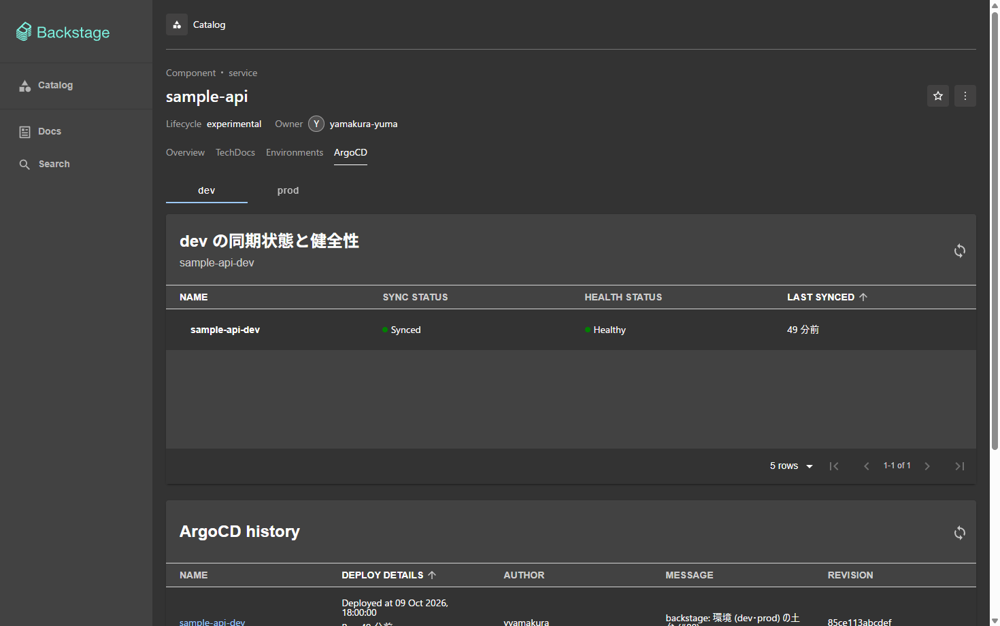
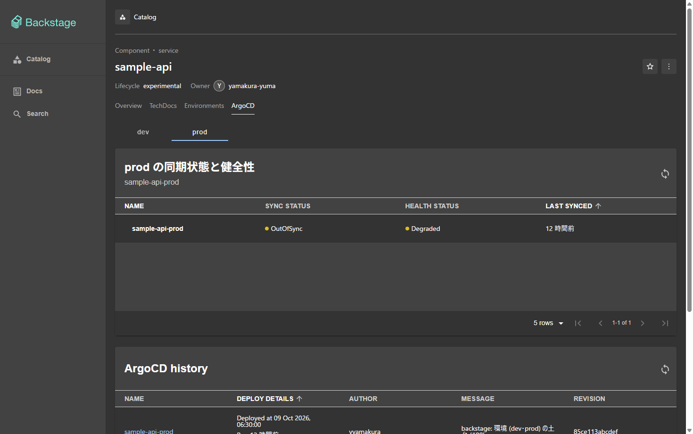

# Backstage に ArgoCD のタブを出す

エンティティ `sample-api` のページに **ArgoCD** のタブを置き、環境 (dev・prod) の切り替えで、それぞれの
Application (`sample-api-dev`・`sample-api-prod`) の同期状態 (Sync) と健全性 (Health) を出す。
環境ごとのタブの仕組みと注釈の規約は [environments.md](environments.md)、Backstage 全体は [backstage.md](backstage.md)。

```
ブラウザ ──▶ Backstage (localhost:7007)
              ├─ タブ ArgoCD  [dev] [prod]   ← 注釈 home-k8s/env.<環境>.argocd-app-name を選ぶ
              └─ /api/proxy/argocd/api/applications/sample-api-dev
                    │  プロキシが Authorization: Bearer ${ARGOCD_AUTH_TOKEN} を付ける (ブラウザには渡らない)
                    ▼
                 argocd-server.argocd.svc /api/v1/applications/sample-api-dev
                    アカウント backstage は Application の get だけ (読み取り専用)
```

## 選んだもの

| 項目 | 選んだもの | 理由 |
|---|---|---|
| プラグイン | `@roadiehq/backstage-plugin-argo-cd` 2.13.1 | 同期状態・健全性・デプロイ履歴を出す部品が揃っている。`/alpha` に新しいフロントエンドシステムの入口 (`FrontendPlugin`) があり、API の拡張 (`ApiBlueprint`) をそのまま使える |
| 画面 | プラグインの部品 `EntityArgoCDOverviewCard`・`EntityArgoCDHistoryCard` を、環境のタブの中で出す | プラグインの注釈 `argocd/app-name` は 1 つしか書けない。環境の値を重ねたエンティティを渡せば、プラグインに手を入れずに環境を切り替えられる |
| 旧 API の部品 | `@backstage/core-compat-api` の `compatWrapper` で包む | 2 つの部品はプラグインの旧 API (`createComponentExtension`) で作られている |
| プロキシ | `/argocd/api` の 1 つ | dev・prod の Application は同じ ArgoCD にある。環境の違いは Application の名前 (注釈の値) で渡す |
| 資格情報 | ArgoCD の読み取り専用アカウント `backstage` の API トークン | admin のパスワードは Backstage に渡さない。トークンは Application の get だけを許す |

## 設定する場所

| 何を | どこに | 中身 |
|---|---|---|
| パッケージ | `backstage/packages/app/package.json` | `@roadiehq/backstage-plugin-argo-cd` 2.13.1、`@backstage/core-compat-api` |
| プラグインの登録 | `backstage/packages/app/src/App.tsx` | `@roadiehq/backstage-plugin-argo-cd/alpha` を `features` に足す (API の拡張を使うため) |
| プラグインの画面を止める | `backstage/app-config.yaml` の `app.extensions` | `entity-content:argocd/ArgoCdPage`・`entity-card:argocd/overviewCard`・`entity-card:argocd/historyCard` を `false`。既定ではどの Component にも出るので、止めて環境のタブだけにする |
| タブ | `backstage/packages/app/src/modules/environments/ArgoCdView.tsx`、`index.tsx` の `argocdContent` | `requires: ['argocd-app-name']`。`entityForEnvironment` で `argocd/app-name` に環境の値を重ねる |
| 注釈 | `services/sample-api/catalog-info.yaml` | `home-k8s/env.dev.argocd-app-name: sample-api-dev`、`home-k8s/env.prod.argocd-app-name: sample-api-prod` |
| プロキシ | `backstage/app-config.yaml` の `proxy.endpoints./argocd/api` | `target: http://argocd-server.argocd.svc.cluster.local/api/v1`、`Authorization: Bearer ${ARGOCD_AUTH_TOKEN}`、`allowedMethods: [GET]` |
| リンク先 | `backstage/app-config.yaml` の `argocd.baseUrl` | `http://localhost:8080` (Application の名前から ArgoCD の画面へ飛ぶ) |
| 履歴の件数 | `backstage/app-config.yaml` の `argocd.revisionsToLoad` | `10`。プラグインは未設定だと `slice(0, -1)` で最後の 1 件を落とすので、履歴が 1 件だと空になる。必ず書く |
| 読み取り専用のアカウント | `clusters/kind/argocd/values.yaml` | `configs.cm.accounts.backstage: apiKey` (トークンだけ、ログイン不可)、`configs.rbac.policy.csv` で `applications, get` だけ |
| トークンを Backstage に渡す | `clusters/kind/backstage/values.yaml` の `extraEnvVarsSecrets` | Secret `backstage-argocd` (キー `ARGOCD_AUTH_TOKEN`) を環境変数にする |
| トークンを作る | `just/argocd-secrets.sh`、`just/argocd.just` の `_argocd-secrets`、`justfile` の `up` | 下の「トークンの作り方」 |

## トークンの作り方 (`just up`)

ArgoCD の API トークンは、admin のセッションでしか作れず、値を指定して作ることもできない。そのため Grafana の
`backstage` ユーザー ([backstage.md](backstage.md) の「Grafana の読み方」) のように「ファイルから Secret を作る」だけでは足りず、
`just up` が ArgoCD を入れたあとにトークンを作る。

1. `just up` が `helm upgrade --install argocd` で、アカウント `backstage` と RBAC を入れた values を ArgoCD に渡す
   (以後は Application `argocd` が同じ values を同期する)。
2. `just/argocd-secrets.sh` が `argocd-server` の Pod の中の `argocd` CLI で、admin としてログインしてトークンを作る
   (admin のパスワードは `argocd-initial-admin-secret` から。`kubectl exec` の標準入力で渡し、引数にも `ps` にも出さない)。
   `accounts.backstage` を入れた直後は ArgoCD がまだ読んでいないことがあるので、最大 10 回 (3 秒おき) 打ち直す。
3. トークンを `~/.local/share/home-k8s/argocd/backstage-token` (Git の外、本人だけが読める) に置く。
   このファイルのトークンが今の ArgoCD で通る (`argocd account get-user-info` が `Logged In: true`) うちは作り直さない。
   打ち直すたびに作ると、ArgoCD のアカウントにトークンが溜まる。クラスタを作り直すと署名鍵が変わって通らなくなるので、そのときだけ作る。
4. Secret `backstage/backstage-argocd` (キー `ARGOCD_AUTH_TOKEN`) を、`kubectl apply` ではなく `replace`・`create` で入れる
   (`apply` は値を `last-applied-configuration` の注釈に残す)。
5. Backstage の chart が Secret を環境変数 `ARGOCD_AUTH_TOKEN` にし、プロキシの `Authorization: Bearer ${ARGOCD_AUTH_TOKEN}` が使う。

公開 repo に入るのは Secret の名前と環境変数の名前だけで、トークンの値は入らない。
admin のパスワードを変えて `argocd-initial-admin-secret` を消した場合は、`just up` がこの手順で止まる。
そのときは、ArgoCD の画面か `argocd account generate-token --account backstage` でトークンを作り、
`~/.local/share/home-k8s/argocd/backstage-token` に置いてから `just up` を打ち直す
(通るトークンならそのまま Secret にする。ただし admin のパスワードが読めないとこの検査まで進まないので、
その場合は `kubectl -n backstage create secret generic backstage-argocd --from-file=ARGOCD_AUTH_TOKEN=<そのファイル>` を手で打つ)。

## 権限

`policy.csv` は `applications, get` だけを許す。Application の取得 (同期状態・健全性・履歴・リビジョンのメタデータ) は読めるが、
作成・同期・削除、ログ、Secret、リポジトリの資格情報は読めない・触れない。`policy.default` は空のままなので、
書いていない操作はすべて拒否される。プロキシも `GET` だけを通す (二重に絞る)。
アカウントは `apiKey` だけなので、パスワードでの画面のログインはできない。

## 確かめ方 (マージ後)

マージの前は、手元の docker で Backstage のイメージを動かし、ArgoCD の API の代わりの応答で画面を確かめる。
クラスタでの確認は、マージ後に人が `just up` を打ってから行う。

```sh
just up   # ArgoCD の values (アカウントと RBAC) を入れ、トークンを作り、Secret backstage-argocd を作る。Backstage のイメージも作り直す (0.8.0)
```

読み取りだけで確かめるコマンド:

```sh
ctx=kind-study-kind
# アカウント backstage が apiKey で入っている
kubectl --context $ctx -n argocd get cm argocd-cm -o jsonpath='{.data.accounts\.backstage}{"\n"}'          # apiKey
kubectl --context $ctx -n argocd get cm argocd-rbac-cm -o jsonpath='{.data.policy\.csv}'
# Secret がある (値は表示しない)
kubectl --context $ctx -n backstage get secret backstage-argocd -o jsonpath='{.data.ARGOCD_AUTH_TOKEN}' | wc -c   # 0 でない
# Backstage の Pod がトークンを環境変数で持っている (値は表示しない)
kubectl --context $ctx -n backstage exec deploy/backstage -- sh -c 'test -n "$ARGOCD_AUTH_TOKEN" && echo set'
# プロキシ経由で Application が読める (ブラウザと同じ経路)
tok=$(curl -s -X POST http://localhost:7007/api/auth/guest/refresh | jq -r .backstageIdentity.token)
for e in dev prod; do
  curl -s -H "Authorization: Bearer $tok" http://localhost:7007/api/proxy/argocd/api/applications/sample-api-$e \
    | jq -r '[.metadata.name, .status.sync.status, .status.health.status] | @tsv'     # sample-api-dev  Synced  Healthy
done
# 読み取り専用であること: 同期の操作 (POST) はプロキシが通さない
curl -s -o /dev/null -w '%{http_code}\n' -X POST -H "Authorization: Bearer $tok" \
  http://localhost:7007/api/proxy/argocd/api/applications/sample-api-dev/sync                                  # 404 などの 4xx
# Application の注釈の値と、実在する Application の名前が揃っている
kubectl --context $ctx -n argocd get applications | grep sample-api
```

画面は <http://localhost:7007/catalog/default/component/sample-api/argocd> を開く。上の `dev`・`prod` を切り替え、
それぞれの Application の名前、Sync Status (Synced)・Health Status (Healthy) が出ることを確かめる。



上の画面は、マージ前に build したイメージを手元の docker で動かし、ArgoCD の API の代わりの応答 (dev は Synced・Healthy、
prod は OutOfSync・Degraded の作り物) を返すサーバーにプロキシを向けて撮ったもの。プロキシが付けるトークンが違うと 401 を返す
ようにしてあり、トークンが環境変数からプロキシの `headers` に入ることも確かめてある。クラスタでの確認はマージ後に行う。

ArgoCD のタブは `sample-api` のようにこの注釈を持つエンティティにだけ出て、`home-k8s` のページには出ない。
Application の名前をクリックすると、ArgoCD の画面 (<http://localhost:8080>) の Application に飛ぶ。

## 困ったとき

| 症状 | 見るところ |
|---|---|
| タブが出ない | エンティティに `home-k8s/environments` と `home-k8s/env.<環境>.argocd-app-name` があるか。カタログは GitHub の `main` から読むので、ブランチでは出ない |
| 「Error occurred while fetching data」と 401・403 | トークンが通っていない。`~/.local/share/home-k8s/argocd/backstage-token` を消して `just up` で作り直す。RBAC の `policy.csv` を確かめる |
| 「Error occurred ...」と 404 | Application の名前 (`kubectl -n argocd get applications`) と注釈の値が違う。`apps/sample-api.yaml` の ApplicationSet が `sample-api-<環境>` を作っているか |
| Backstage の Pod が `CreateContainerConfigError` | Secret `backstage-argocd` が無い。`just up` の `_argocd-secrets` が失敗していないか |
| プラグインの既定のタブが出る | `app-config.yaml` の `app.extensions` の 3 つの `false` が効いていない。拡張の名前 (`entity-content:argocd/ArgoCdPage` など) を確かめる |
