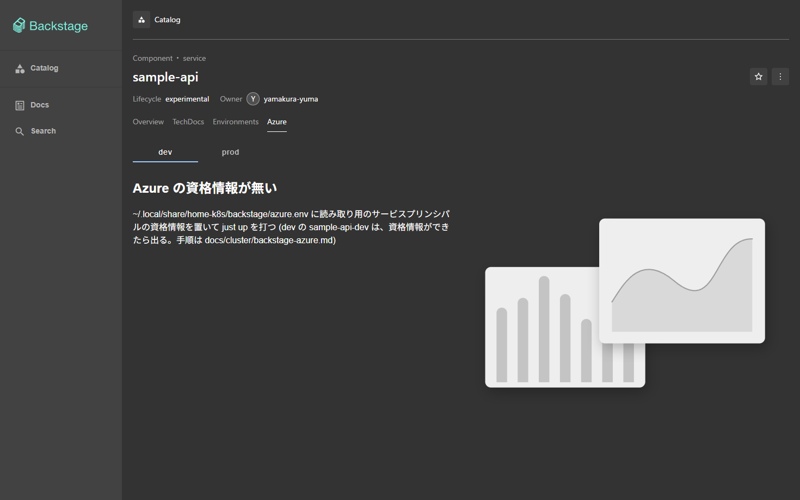
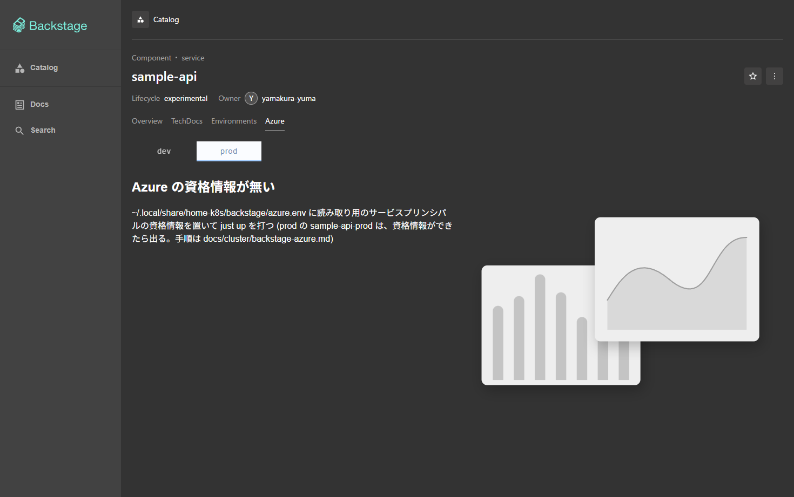
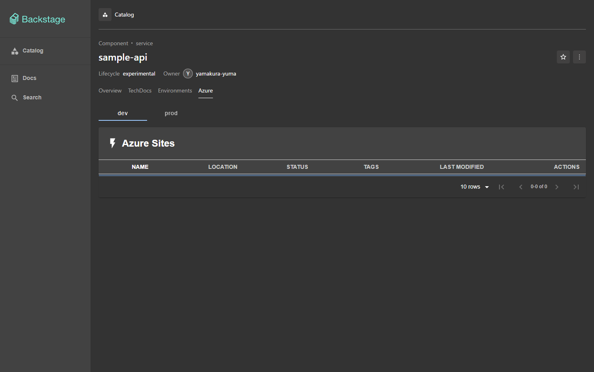

# Backstage の Azure のタブ

エンティティ `sample-api` のページに **Azure** のタブを置く。dev・prod を切り替えて、環境ごとの Azure の
App Service・Functions (Web アプリ) を一覧にする。Azure の資格情報はまだ無いので、**資格情報が無くても
Backstage は起動し、タブは「Azure の資格情報が無い」と出す**。資格情報を置いて `just up` を打てば、同じタブが
実データを出す。環境ごとのタブの仕組みは [environments.md](environments.md)。

```text
~/.local/share/home-k8s/backstage/azure.env      (Git の外。無くてよい)
  └─ just up (just/backstage-azure-secret.sh) ──▶ Secret backstage/backstage-azure   (ファイルがあるときだけ)
       └─ chart の extraEnvVars (optional) ──▶ Pod の環境変数 AZURE_*
            └─ app-config.yaml azureSites: ${AZURE_*}
                 ├─ 4 つとも揃う ─▶ 公式の azure-sites バックエンド ─▶ Azure Resource Graph  ─▶ /health 200
                 └─ 欠ける      ─▶ 代役のプラグイン (azureSites.ts)                           ─▶ /health 503
ブラウザ: Azure のタブ ─▶ /api/azure-sites/health ─┬ 503 ─▶ 「Azure の資格情報が無い」
                                                   └ 200 ─▶ 部品 (注釈 azure.com/microsoft-web-sites = 環境の値)
```

## 選んだプラグイン

| 部品 | パッケージ | 版 |
|---|---|---|
| フロントエンド | `@backstage-community/plugin-azure-sites` (`packages/app`) | 0.13.0 |
| バックエンド | `@backstage-community/plugin-azure-sites-backend` (`packages/backend`) | 0.16.0 |
| 新旧の橋渡し | `@backstage/core-compat-api` (`packages/app`) | 0.5.15 |

- **azure-sites を選んだ理由**: Azure のリソースを Azure の API (ARM の Resource Graph) で読むプラグインのうち、
  保守されている (2026-04 に更新) のはこれだけ。`@backstage-community/plugin-azure-resources` という名前のものは
  npm に無い。`@vippsno/plugin-azure-resources` (任意のリソースをタグで引く) は 2024-03 で止まり、React 16/17 と
  `@backstage/core-components` 0.11 に固定されていて、いまのアプリ (React 18、Backstage 1.55) に入らない。
  Azure DevOps 用の `plugin-azure-devops` は別物 (リポジトリ・パイプライン) で対象外
- **見せられるのは App Service と Functions だけ**: バックエンドの問い合わせは
  `resources | where type == 'microsoft.web/sites' | where name contains '<名前>'` に固定。VM・ストレージなど
  任意のリソースは出せない。出す種類を広げるなら、プラグインを替えるか自作する
- **バックエンドのプラグインが要る**: ブラウザは Azure を直接読まない。`azure-sites` のバックエンドが
  サービスプリンシパルで Azure を読み、`/api/azure-sites/…` で返す
- **新しいフロントエンドシステムの入口 (`/alpha`) が無い**: 古い `createPlugin` で書かれている。
  `convertLegacyPlugin` で API (`azureSiteApiRef`) を新しいシステムの拡張にし、部品は `compatWrapper` で包んで出す
  (`backstage/packages/app/src/modules/azure/`)。内部で古い `@backstage/plugin-catalog-react` 1.x が入るが、
  エンティティの文脈は版をまたいで共有されるので、`EntityProvider` で渡したエンティティを部品が読める

## 環境ごとにリソースを絞る

プラグインは注釈 `azure.com/microsoft-web-sites: <名前>` で Web アプリを探す (**部分一致、大文字小文字を問わない**)。
環境ごとの値は規約のキー `azure-web-sites` に持ち、タブが `entityForEnvironment` でプラグインの注釈に重ねて渡す。

```yaml
# services/sample-api/catalog-info.yaml
home-k8s/env.dev.azure-web-sites: sample-api-dev
home-k8s/env.prod.azure-web-sites: sample-api-prod
```

Azure 側では、Web アプリの名前に `sample-api-dev`・`sample-api-prod` を含めるか、注釈の値を実際の名前に合わせる。
注釈の無い環境のエンティティにはタブを出さない。名前の部分一致なので、`sample-api` だけにすると dev と prod が
どちらにも出る。

## 資格情報の用意

読み取り用のサービスプリンシパルを作り、そのファイルを Git の外に置く。**公開 repo には入れない**。

### サービスプリンシパルの作り方と要る権限

```sh
az login
sub=$(az account show --query id -o tsv)
# Reader (閲覧者) をサブスクリプションに付けたサービスプリンシパルを作る。出力の appId・password・tenant を控える
az ad sp create-for-rbac --name home-k8s-backstage-reader --role Reader --scopes "/subscriptions/$sub"
# ポータルの URL (https://portal.azure.com/#@<ここ>/) に出るディレクトリのドメイン
az rest --method get --url 'https://graph.microsoft.com/v1.0/domains' --query "value[?isDefault].id" -o tsv
```

- 要る権限は、対象のサブスクリプションの **Reader** だけ。Resource Graph の問い合わせ (`microsoft.web/sites` の一覧) は
  読み取りで足りる。プラグインには Web アプリを起動・停止するボタンがあるが、**Contributor は付けない** (押しても拒否される)
- パスワード (`clientSecret`) は作ったときにしか見えない。期限がある (既定 1 年)。切れたら `az ad sp credential reset` で作り直し、
  ファイルを書き換える
- 複数のサブスクリプションを読むときは、`AZURE_SUBSCRIPTION_ID` が 1 つなので別の仕組みが要る (いまは 1 つだけ)

### 置くファイル

`~/.local/share/home-k8s/backstage/azure.env` (他の秘密のファイルと同じ `~/.local/share/home-k8s/` の下)。
`KEY=VALUE` の行で、`#` の行と空行は読み飛ばす。シェルとして実行はしない。

```sh
mkdir -p ~/.local/share/home-k8s/backstage
install -m 600 /dev/null ~/.local/share/home-k8s/backstage/azure.env
$EDITOR ~/.local/share/home-k8s/backstage/azure.env
```

```ini
# 読み取り用のサービスプリンシパル (Reader)
AZURE_DOMAIN=contoso.onmicrosoft.com
AZURE_TENANT_ID=<tenant>
AZURE_CLIENT_ID=<appId>
AZURE_CLIENT_SECRET=<password>
AZURE_SUBSCRIPTION_ID=<サブスクリプションの id>
```

| 項目 | 入るところ | 要るか |
|---|---|---|
| `AZURE_DOMAIN` | `azureSites.domain` (ポータルへのリンクを作る) | 要る |
| `AZURE_TENANT_ID` | `azureSites.tenantId` | 要る |
| `AZURE_CLIENT_ID` | `azureSites.clientId` | 要る |
| `AZURE_CLIENT_SECRET` | `azureSites.clientSecret` | 要る |
| `AZURE_SUBSCRIPTION_ID` | `azureSites.subscriptions[0].id` (読むサブスクリプションを絞る) | 要る |

### 反映

```sh
just up                                            # ファイルから Secret backstage-azure を作る (無ければ作らず、あれば消す)
kubectl --context kind-study-kind -n backstage delete pod -l app.kubernetes.io/name=backstage   # 環境変数は起動時にしか読まれない
```

- ファイルが無い・空なら、`just up` は Secret を作らず (前の Secret があれば消し)、失敗しない
- ファイルがあって項目が欠けているときは、欠けた項目の名前を出して `just up` が止まる
- `Secret backstage-azure` の鍵は 5 つ。`values.yaml` の `extraEnvVars` が `optional: true` で参照するので、
  Secret が無くても Pod は起動する
- 資格情報が揃わないとき、バックエンドは公式のプラグインを載せない。公式のプラグインは起動時に
  `azureSites.domain`・`tenantId` が無いと落ち、Backstage ごと起動しなくなるため。代わりに同じ `azure-sites` の
  代役 (`packages/backend/src/azureSites.ts`) が `/health` に 503 を返し、タブがそれを見て「資格情報が無い」を出す

## 確かめ方

### 手元の docker (マージ前)

```sh
docker build -t home-k8s-backstage:test backstage
# 資格情報なし: 起動し、/health が 503
docker run --rm --network host -e PORT=7007 home-k8s-backstage:test
tok=$(curl -s -X POST http://localhost:7007/api/auth/guest/refresh | jq -r .backstageIdentity.token)
curl -s -o /dev/null -w '%{http_code}\n' http://localhost:7007/api/azure-sites/health      # 503
# 偽の資格情報あり: 公式のプラグインが載り、/health が 200 (Azure の呼び出しは認証で失敗する)
docker run --rm --network host -e AZURE_DOMAIN=x.onmicrosoft.com -e AZURE_TENANT_ID=t -e AZURE_CLIENT_ID=c \
  -e AZURE_CLIENT_SECRET=s -e AZURE_SUBSCRIPTION_ID=u home-k8s-backstage:test
```

### マージ後のクラスタ (読み取りだけ。話題チャットが確かめる)

人が `just up` を打ったあと。資格情報のファイルが無い状態 (いまの状態) での期待値を書く。

```sh
ctx=kind-study-kind
kubectl --context $ctx -n backstage get secret backstage-azure          # NotFound (ファイルが無いので作られない)
kubectl --context $ctx -n backstage get pods                            # backstage が Running (optional なので起動する)
kubectl --context $ctx -n backstage logs deploy/backstage | grep -i 'azureSites'   # 「資格情報が無い」の行
tok=$(curl -s -X POST http://localhost:7007/api/auth/guest/refresh | jq -r .backstageIdentity.token)
curl -s -o /dev/null -w '%{http_code}\n' http://localhost:7007/api/azure-sites/health          # 503
curl -s -H "Authorization: Bearer $tok" http://localhost:7007/api/catalog/entities/by-name/component/default/sample-api \
  | jq '.metadata.annotations | with_entries(select(.key|test("azure")))'                      # dev・prod の azure-web-sites
```

ブラウザでは <http://localhost:7007/catalog/default/component/sample-api/azure> を開く。「Azure の資格情報が無い」と
出て、上の `dev`・`prod` を切り替えられる (`?env=prod`)。

資格情報を置いたあとは、`/health` が 200 になり、タブが Web アプリの表 (名前・種類・状態・場所・リソースグループ) を出す。
`kubectl … get secret backstage-azure -o jsonpath='{.data}' | jq 'keys'` で鍵の名前だけを確かめる (値は出さない)。

手元の docker で、資格情報なしで起動したイメージのタブ (マージ前の確認)。




偽の資格情報 (Azure の認証は通らない) を `AZURE_*` に渡して起動すると、公式のプラグインが載り、同じタブが部品 (Azure Sites の表) を出す。


