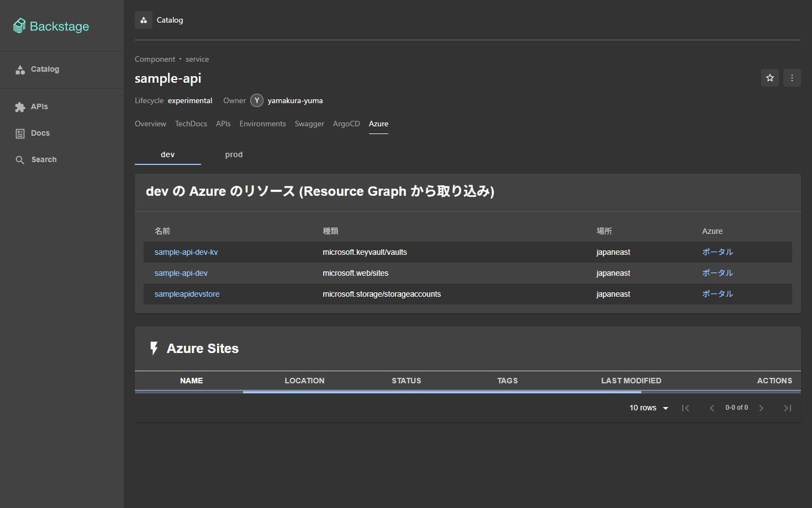
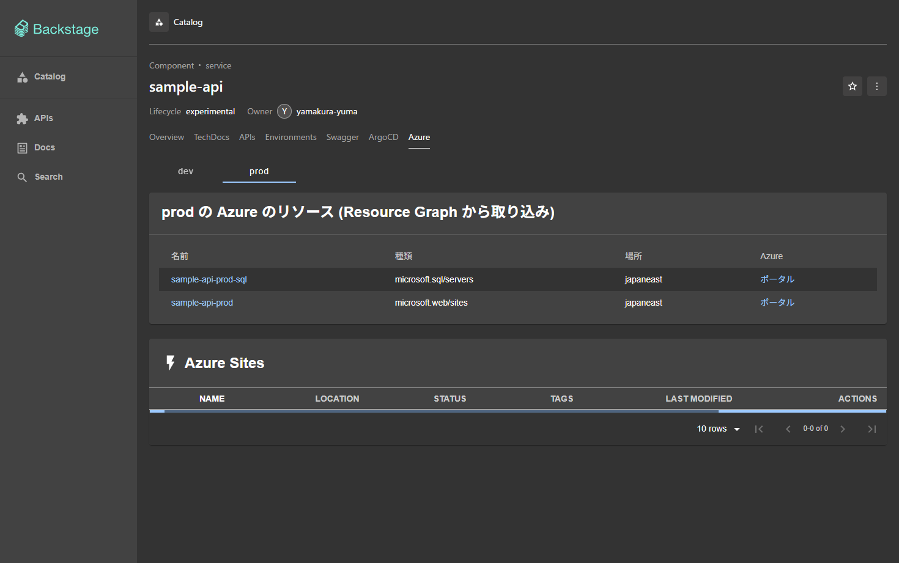

# Backstage の Azure のタブ

エンティティ `sample-api` のページに **Azure** のタブを置く。dev・prod を切り替えて、環境ごとの Azure の
App Service・Functions (Web アプリ) を一覧にする。Azure の資格情報はまだ無いので、**資格情報が無くても
Backstage は起動し、タブは「Azure の資格情報が無い」と出す**。資格情報を置いて `just up` を打てば、同じタブが
実データを出す。環境ごとのタブの仕組みは [environments.md](environments.md)。

タブには、App Service・Functions (azure-sites) のほかに、**Azure のリソース全般 (ストレージ・Key Vault・SQL など)** を
カタログの Resource として取り込んだ一覧も出す ([下の「Azure のリソースの取り込み」](#azure-のリソースの取り込み-resource-graph))。

```text
~/.local/share/home-k8s/backstage/azure.env      (Git の外。無くてよい)
  └─ just up (just/backstage-azure-secret.sh) ──▶ Secret backstage/backstage-azure   (ファイルがあるときだけ)
       └─ chart の extraEnvVars (optional) ──▶ Pod の環境変数 AZURE_*
            └─ app-config.yaml azureSites: ${AZURE_*}
                 ├─ 4 つとも揃う ─▶ 公式の azure-sites バックエンド ─▶ Azure Resource Graph  ─▶ /health 200
                 └─ 欠ける      ─▶ 代役のプラグイン (azureSites.ts)                           ─▶ /health 503
ブラウザ: Azure のタブ ─▶ /api/azure-sites/health ─┬ 503 ─▶ 「Azure の資格情報が無い」
                                                   └ 200 ─▶ 部品 (注釈 azure.com/microsoft-web-sites = 環境の値)
```

## 選んだプラグイン

| 部品 | パッケージ | 版 |
|---|---|---|
| フロントエンド | `@backstage-community/plugin-azure-sites` (`packages/app`) | 0.13.0 |
| バックエンド | `@backstage-community/plugin-azure-sites-backend` (`packages/backend`) | 0.16.0 |
| 新旧の橋渡し | `@backstage/core-compat-api` (`packages/app`) | 0.5.15 |

- **azure-sites を選んだ理由**: Azure のリソースを Azure の API (ARM の Resource Graph) で読むプラグインのうち、
  保守されている (2026-04 に更新) のはこれだけ。`@backstage-community/plugin-azure-resources` という名前のものは
  npm に無い。`@vippsno/plugin-azure-resources` (任意のリソースをタグで引く) は 2024-03 で止まり、React 16/17 と
  `@backstage/core-components` 0.11 に固定されていて、いまのアプリ (React 18、Backstage 1.55) に入らない。
  Azure DevOps 用の `plugin-azure-devops` は別物 (リポジトリ・パイプライン) で対象外
- **見せられるのは App Service と Functions だけ**: バックエンドの問い合わせは
  `resources | where type == 'microsoft.web/sites' | where name contains '<名前>'` に固定。VM・ストレージなど
  任意のリソースは出せない。出す種類を広げるなら、プラグインを替えるか自作する
- **バックエンドのプラグインが要る**: ブラウザは Azure を直接読まない。`azure-sites` のバックエンドが
  サービスプリンシパルで Azure を読み、`/api/azure-sites/…` で返す
- **新しいフロントエンドシステムの入口 (`/alpha`) が無い**: 古い `createPlugin` で書かれている。
  `convertLegacyPlugin` で API (`azureSiteApiRef`) を新しいシステムの拡張にし、部品は `compatWrapper` で包んで出す
  (`backstage/packages/app/src/modules/azure/`)。内部で古い `@backstage/plugin-catalog-react` 1.x が入るが、
  エンティティの文脈は版をまたいで共有されるので、`EntityProvider` で渡したエンティティを部品が読める

## 環境ごとにリソースを絞る

プラグインは注釈 `azure.com/microsoft-web-sites: <名前>` で Web アプリを探す (**部分一致、大文字小文字を問わない**)。
環境ごとの値は規約のキー `azure-web-sites` に持ち、タブが `entityForEnvironment` でプラグインの注釈に重ねて渡す。

```yaml
# services/sample-api/catalog-info.yaml
home-k8s/env.dev.azure-web-sites: sample-api-dev
home-k8s/env.prod.azure-web-sites: sample-api-prod
```

Azure 側では、Web アプリの名前に `sample-api-dev`・`sample-api-prod` を含めるか、注釈の値を実際の名前に合わせる。
注釈の無い環境のエンティティにはタブを出さない。名前の部分一致なので、`sample-api` だけにすると dev と prod が
どちらにも出る。

## Azure のリソースの取り込み (Resource Graph)

`@backstage-community/plugin-catalog-backend-module-azure-resources` (0.12.0) が、Azure Resource Graph の KQL で
Azure のリソースを引き、カタログの **Resource** エンティティとして取り込む。取り込んだ Resource は sample-api の
Component に `spec.dependencyOf` で結ばれ、Azure のタブの上の表に、選んだ環境 (dev・prod) の分だけ出る。
azure-sites (下の表) とは別のプラグインで、App Service・Functions に限らず**どの種類のリソースも**取り込める。

```text
Azure 側のタグ:  environment=dev|prod   service=sample-api
  └─ KQL (app-config.yaml catalog.providers.azureResources) ─▶ Resource Graph (サービスプリンシパルの Reader)
       ├─ プロバイダー sample-api-dev  (tags.environment == 'dev')  ─▶ Resource  namespace: dev   dependencyOf: component:default/sample-api
       └─ プロバイダー sample-api-prod (tags.environment == 'prod') ─▶ Resource  namespace: prod  dependencyOf: component:default/sample-api
ブラウザ: Azure のタブ [dev] [prod] ─▶ catalog API (kind=Resource, namespace=<環境>, relations.dependencyOf=component:default/sample-api)
```

| 部品 | パッケージ | 版 |
|---|---|---|
| カタログのモジュール (`packages/backend`) | `@backstage-community/plugin-catalog-backend-module-azure-resources` | 0.12.0 |
| 認証・Resource Graph のクライアント (上の依存) | `@backstage-community/plugin-azure-resources-node` | 0.15.0 |

### 選んだ方式とその理由

- **このモジュールを選んだ理由**: Azure の任意のリソースを KQL で引いてカタログに入れられるのはこれ。azure-sites
  (`microsoft.web/sites` 固定) では VM・ストレージなどを出せない。ブラウザは Azure を直接読まず、バックエンドの
  カタログが一定の間隔 (30 分) で取り込むので、タブはカタログ (Backstage の DB) を読むだけで済む
- **dev・prod でプロバイダーを分けた**: 1 つの KQL で取り込んで環境を注釈に写す案もあるが、分けると (1) 片方の
  問い合わせが落ちても、もう片方の Resource は消えない (プロバイダーごとに「全部入れ替え」をするため)、
  (2) モジュールの対応づけは**設定の値を Azure の行の項目名として引くだけ**で、プロバイダーごとの固定値を書けないので、
  KQL の `extend environment = 'dev'` で環境の列を足して `metadata.namespace` に引かせるのが素直、になる
- **環境を namespace にした**: Resource の名前は Azure のリソースの名前そのまま (`sample-api-kv` など) で、環境をまたいで
  同じ名前がありうる。同じ namespace・kind・名前は 1 つしか持てないので、環境 (`dev`・`prod`) を namespace にして
  `resource:dev/<名前>`・`resource:prod/<名前>` に分ける。環境の名前は `home-k8s/environments` (環境のタブの切り替え) と同じ
- **sample-api との関係は `spec.dependencyOf`**: Resource の `dependencyOf` が `component:default/sample-api` を指すと、
  Component の `dependsOn` として逆向きにも結ばれる (Component の relations に `resource:dev/…` が並ぶ)。
  名前空間が `default` でないので `default/` を省略せず書く (省略すると同じ namespace = `dev` の中を探して解決できない)。
  `owner` (`defaultOwner`) も同じ理由で `user:default/yamakura-yuma`
- **表示は Azure のタブの中**: 表は azure-sites の `/health` が 200 のとき (資格情報が揃うとき) だけ出る。`AZURE_DOMAIN` だけが欠けると、取り込みは走るがタブは「資格情報が無い」を出すので、5 つとも置く。
  タブは注釈 `azure-web-sites` を持つ環境にだけ出るので、Web アプリの無いサービスは、その注釈を (使わない名前でも) 付けないとタブが出ない。
  ここから先: 環境のタブの切り替え (`createEnvironmentContent`) に乗り、選んだ環境の namespace の
  Resource を `catalogApi.getEntities` で引く (`packages/app/src/modules/azure/AzureResourcesList.tsx`)。
  Resource の名前のリンクは、カタログの Resource のページ (`/catalog/dev/resource/<名前>`) を開く

### 設定 (app-config.yaml)

```yaml
azureResources:
  credentials:                       # azure-sites と同じサービスプリンシパル
    tenantId: ${AZURE_TENANT_ID}
    clientId: ${AZURE_CLIENT_ID}
    clientSecret: ${AZURE_CLIENT_SECRET}
catalog:
  providers:
    azureResources:
      - id: sample-api-dev           # prod も同じ形で、'dev' を 'prod' にしたもの
        query: |
          resources
          | where tolower(tostring(tags['environment'])) == 'dev'
          | where tolower(tostring(tags['service'])) == 'sample-api'
          | extend environment = 'dev'
        scope:
          subscriptions: [${AZURE_SUBSCRIPTION_ID}]
        schedule: { frequency: { minutes: 30 }, timeout: { minutes: 5 } }
        defaultOwner: user:default/yamakura-yuma
        mapping:
          metadata:
            namespace: environment            # KQL で足した列。値は環境の名前
            annotations:
              home-k8s/environment: environment
          spec:
            dependencyOf: [component:default/sample-api]
```

- `tolower(tostring(...))` で、タグの値の大文字小文字 (`Dev`・`DEV`) の違いを吸収する (KQL の `==` は大文字小文字を区別する)。
  タグの名前 (`environment`・`service`) は小文字で付ける
- `mapping` の値のうち、文字列は「Azure の行のその項目の値」を引く (`environment` は KQL で足した列、
  `tags.x` なら行の `tags` の `x`)。配列 (`dependencyOf`) は書いたとおりの値になる
- `owner` は、リソースのタグ `backstage.io-owner` (`user:default/<名前>` など) があればそれ、無ければ `defaultOwner`
- 既定で付く注釈: `backstage.io/view-url` (Azure ポータルへのリンク)・`management.azure.com/resourceId`・
  `management.azure.com/subscriptionId`・`management.azure.com/location`
- 取り込みは 30 分ごと。すぐ見たいときは Backstage の Pod を作り直す (起動後すぐに 1 回走る)
- 別のサービスのリソースも取り込むときは、プロバイダーを足す (`id`・KQL の `service` の値・`dependencyOf` を、そのサービスの
  Component に合わせる)。そのサービスの Component に環境の注釈 (`home-k8s/env.<環境>.azure-web-sites`) を付ければ、
  同じ Azure のタブに出る

### 資格情報が無いとき

資格情報 (`azureResources.credentials` の 3 つと `scope.subscriptions`) のどれかが欠けると、バックエンドは
**このモジュールを載せない** (`packages/backend/src/azureResources.ts`)。載せると、認証が `DefaultAzureCredential` に落ちて
30 分ごとに失敗のログを出し続けるため。載せなくても、カタログの他の読み込み (GitHub の `catalog-info.yaml`) には関係しない。
資格情報の置き方は下の「資格情報の用意」で、azure-sites と同じファイル・同じ Secret を使う (追加のファイルは無い)。

### Azure 側のタグの付け方

取り込まれるリソースは、**タグ `environment` が `dev` か `prod`、かつタグ `service` が `sample-api`** のもの。
タグの無いリソース・別のサービスのリソース・`stg` などは取り込まれない (KQL が落とす)。

```sh
# 既存のリソースに付ける (他のタグは残す --operation Merge)
id=$(az resource show -g <リソースグループ> -n <名前> --resource-type <例: Microsoft.Storage/storageAccounts> --query id -o tsv)
az tag update --resource-id "$id" --operation Merge --tags environment=dev service=sample-api
# オーナーを変えたいとき (任意)
az tag update --resource-id "$id" --operation Merge --tags backstage.io-owner=user:default/yamakura-yuma
# 付いたリソースを、取り込みと同じ条件で確かめる
az graph query -q "resources | where tolower(tostring(tags['environment'])) == 'dev' | where tolower(tostring(tags['service'])) == 'sample-api' | project name, type, location"
```

- リソースグループのタグはリソースに引き継がれない。リソースごとに付ける (Azure Policy の `Inherit a tag from the resource group` で
  付けることもできる)
- 値は大文字小文字を問わない (`Dev` でも取り込まれる)。Resource の名前は Azure のリソースの名前なので、
  Backstage の名前の規則 (英数字・`-`・`_`・`.`、63 文字まで) を外れる名前のリソースは、カタログの検証で落ちてログに出る
- 同じ環境の中で、名前が同じで種類が違うリソースが 2 つあると、同じ Resource の名前になって競合し、片方しか入らない。名前を分ける

### サービスプリンシパルに要る権限

azure-sites と同じサービスプリンシパルで足りる。Resource Graph は、**そのプリンシパルが `Reader` (閲覧者) を持つ範囲
(`scope.subscriptions` のサブスクリプション) のリソースだけ**を返す。ほかの権限 (Contributor・Resource Graph 用の
別のロール) は要らない。`Reader` が無いリソースグループがあれば、そこのリソースは黙って出ない (エラーにならない)。
管理グループで引くときは、`scope.managementGroups` にして、その管理グループに `Reader` を付ける。

## 資格情報の用意

読み取り用のサービスプリンシパルを作り、そのファイルを Git の外に置く。**公開 repo には入れない**。

### サービスプリンシパルの作り方と要る権限

```sh
az login
sub=$(az account show --query id -o tsv)
# Reader (閲覧者) をサブスクリプションに付けたサービスプリンシパルを作る。出力の appId・password・tenant を控える
az ad sp create-for-rbac --name home-k8s-backstage-reader --role Reader --scopes "/subscriptions/$sub"
# ポータルの URL (https://portal.azure.com/#@<ここ>/) に出るディレクトリのドメイン
az rest --method get --url 'https://graph.microsoft.com/v1.0/domains' --query "value[?isDefault].id" -o tsv
```

- 要る権限は、対象のサブスクリプションの **Reader** だけ。Resource Graph の問い合わせ (`microsoft.web/sites` の一覧) は
  読み取りで足りる。プラグインには Web アプリを起動・停止するボタンがあるが、**Contributor は付けない** (押しても拒否される)
- パスワード (`clientSecret`) は作ったときにしか見えない。期限がある (既定 1 年)。切れたら `az ad sp credential reset` で作り直し、
  ファイルを書き換える
- 複数のサブスクリプションを読むときは、`AZURE_SUBSCRIPTION_ID` が 1 つなので別の仕組みが要る (いまは 1 つだけ)

### 置くファイル

`~/.local/share/home-k8s/backstage/azure.env` (他の秘密のファイルと同じ `~/.local/share/home-k8s/` の下)。
`KEY=VALUE` の行で、`#` の行と空行は読み飛ばす。シェルとして実行はしないので、値は引用符で囲まない (囲むと引用符も値に入る)。

```sh
mkdir -p ~/.local/share/home-k8s/backstage
install -m 600 /dev/null ~/.local/share/home-k8s/backstage/azure.env
$EDITOR ~/.local/share/home-k8s/backstage/azure.env
```

```ini
# 読み取り用のサービスプリンシパル (Reader)
AZURE_DOMAIN=contoso.onmicrosoft.com
AZURE_TENANT_ID=<tenant>
AZURE_CLIENT_ID=<appId>
AZURE_CLIENT_SECRET=<password>
AZURE_SUBSCRIPTION_ID=<サブスクリプションの id>
```

| 項目 | 入るところ | 要るか |
|---|---|---|
| `AZURE_DOMAIN` | `azureSites.domain` (ポータルへのリンクを作る) | 要る |
| `AZURE_TENANT_ID` | `azureSites.tenantId` | 要る |
| `AZURE_CLIENT_ID` | `azureSites.clientId` | 要る |
| `AZURE_CLIENT_SECRET` | `azureSites.clientSecret` | 要る |
| `AZURE_SUBSCRIPTION_ID` | `azureSites.subscriptions[0].id` (読むサブスクリプションを絞る) | 要る |

### 反映

```sh
just up                                            # ファイルから Secret backstage-azure を作る (無ければ作らず、あれば消す)
kubectl --context kind-study-kind -n backstage delete pod -l app.kubernetes.io/name=backstage   # 環境変数は起動時にしか読まれない
```

- ファイルが無い・空なら、`just up` は Secret を作らず (前の Secret があれば消し)、失敗しない
- ファイルがあって項目が欠けているときは、欠けた項目の名前を出して `just up` が止まる
- `Secret backstage-azure` の鍵は 5 つ。`values.yaml` の `extraEnvVars` が `optional: true` で参照するので、
  Secret が無くても Pod は起動する
- 資格情報が揃わないとき、バックエンドは公式のプラグインを載せない。公式のプラグインは起動時に
  `azureSites.domain`・`tenantId` が無いと落ち、Backstage ごと起動しなくなるため。代わりに同じ `azure-sites` の
  代役 (`packages/backend/src/azureSites.ts`) が `/health` に 503 を返し、タブがそれを見て「資格情報が無い」を出す

## 確かめ方

### 手元の docker (マージ前)

```sh
docker build -t home-k8s-backstage:test backstage
# クラスタの外では catalog (GitHub の main)・プロキシ (sample-api の Service)・ポートが合わないので、
# 上書きの設定 app-config.local.yaml (catalog の url location、proxy の target、listen.port) を重ねる。
# やり方は environments.md の確かめ方と同じ (sample-api を app.py で dev・prod に 2 つ、カタログを http.server で配る)
# 資格情報なし: 起動し、/health が 503
docker run --rm --network host -v $PWD/app-config.local.yaml:/app/app-config.local.yaml:ro home-k8s-backstage:test \
  node packages/backend --config app-config.yaml --config app-config.local.yaml
tok=$(curl -s -X POST http://localhost:7007/api/auth/guest/refresh | jq -r .backstageIdentity.token)
curl -s -o /dev/null -w '%{http_code}\n' http://localhost:7007/api/azure-sites/health      # 503
# 偽の資格情報あり: 公式のプラグインが載り、/health が 200 (Azure の呼び出しは認証で失敗する)
docker run --rm --network host -e AZURE_DOMAIN=x.onmicrosoft.com -e AZURE_TENANT_ID=t -e AZURE_CLIENT_ID=c \
  -e AZURE_CLIENT_SECRET=s -e AZURE_SUBSCRIPTION_ID=u -v $PWD/app-config.local.yaml:/app/app-config.local.yaml:ro \
  home-k8s-backstage:test node packages/backend --config app-config.yaml --config app-config.local.yaml
```

### 手元の docker での Resource の取り込み (偽の Resource Graph)

実サブスクリプションが無いので、Azure の Resource Graph の応答を偽物にして、取り込みから画面までを通しで確かめる。
`backstage/dev/fake-azure-resource-graph.js` は、`ResourceGraphClient.resources()` を、表 (dev・prod のタグが付いたものと、
絞り込みで落ちるはずのもの) に対して app-config.yaml の KQL と同じ 3 つの条件 (`tags.environment`・`tags.service`・
`extend environment`) をかけて返すものに差し替える preload。KQL を解釈するのではない (KQL そのものは Azure の実物でしか確かめられない)。
本番のイメージでは使わない (`.dockerignore` で入れない)。

```sh
# app-config.local.yaml は上の「手元の docker」と同じ。ただしクラスタの Backstage が 7007 を使っているので、
# listen.port と app.baseUrl・backend.baseUrl・backend.cors.origin を 17007 にする
docker run --rm --network host -v $PWD/app-config.local.yaml:/app/app-config.local.yaml:ro -v $PWD/backstage/dev:/fake:ro \
  -e NODE_OPTIONS='--require /fake/fake-azure-resource-graph.js' \
  -e AZURE_DOMAIN=x.onmicrosoft.com -e AZURE_TENANT_ID=00000000-0000-0000-0000-0000000000bb -e AZURE_CLIENT_ID=c \
  -e AZURE_CLIENT_SECRET=s -e AZURE_SUBSCRIPTION_ID=00000000-0000-0000-0000-0000000000aa \
  home-k8s-backstage:test node packages/backend --config app-config.yaml --config app-config.local.yaml
tok=$(curl -s -X POST http://localhost:17007/api/auth/guest/refresh | jq -r .backstageIdentity.token)
curl -s -H "Authorization: Bearer $tok" 'http://localhost:17007/api/catalog/entities?filter=kind=resource' \
  | jq -r '.[] | "\(.metadata.namespace)/\(.metadata.name)  \(.spec.type)"'
```

確かめた結果 (dev に 3 つ・prod に 2 つ。`stg` のタグ・別のサービス・タグ無しは入らない。タグの値 `Dev` も dev に入る):

```text
[fake-resource-graph] env=dev -> 3 rows      [fake-resource-graph] env=prod -> 2 rows
dev/sample-api-dev-kv    microsoft.keyvault/vaults        prod/sample-api-prod      microsoft.web/sites
dev/sample-api-dev       microsoft.web/sites              prod/sample-api-prod-sql  microsoft.sql/servers
dev/sampleapidevstore    microsoft.storage/storageaccounts
Component sample-api の relations の dependsOn: resource:dev/… 3 つ・resource:prod/… 2 つ
```

資格情報なし (`AZURE_*` を渡さない) では、取り込みのモジュールは載らず (ログに `azure-resource` が出ない)、
`azure-sites` の代役が `/health` に 503 を返し、カタログの Component・API は読み込まれる。




### マージ後のクラスタ (読み取りだけ。話題チャットが確かめる)

人が `just up` を打ったあと。資格情報のファイルが無い状態 (いまの状態) での期待値を書く。

```sh
ctx=kind-study-kind
kubectl --context $ctx -n backstage get secret backstage-azure          # NotFound (ファイルが無いので作られない)
kubectl --context $ctx -n backstage get pods                            # backstage が Running (optional なので起動する)
kubectl --context $ctx -n backstage logs deploy/backstage | grep -i 'azureSites'   # 「資格情報が無い」の行
tok=$(curl -s -X POST http://localhost:7007/api/auth/guest/refresh | jq -r .backstageIdentity.token)
curl -s -o /dev/null -w '%{http_code}\n' http://localhost:7007/api/azure-sites/health          # 503
curl -s -H "Authorization: Bearer $tok" http://localhost:7007/api/catalog/entities/by-name/component/default/sample-api \
  | jq '.metadata.annotations | with_entries(select(.key|test("azure")))'                      # dev・prod の azure-web-sites
```

ブラウザでは <http://localhost:7007/catalog/default/component/sample-api/azure> を開く。「Azure の資格情報が無い」と
出て、上の `dev`・`prod` を切り替えられる (`?env=prod`)。

Resource の取り込み (資格情報が無い状態の期待値):

```sh
kubectl --context $ctx -n backstage logs deploy/backstage | grep -ci 'azure-resource'            # 0 (モジュールが載らない)
kubectl --context $ctx -n backstage logs deploy/backstage | grep -i 'level":"error' | head      # 取り込み・DefaultAzureCredential の失敗が無い
curl -s -H "Authorization: Bearer $tok" 'http://localhost:7007/api/catalog/entities?filter=kind=resource' | jq length   # 0
curl -s -H "Authorization: Bearer $tok" 'http://localhost:7007/api/catalog/entities?filter=kind=component,kind=api' \
  | jq -r '.[] | "\(.kind) \(.metadata.name)"'                                                  # sample-api の Component と API ほか、カタログの他の読み込みが無事
```

資格情報を置いて `just up` と Pod の作り直しを済ませたあとは、ログに `Registered scheduled task: azure-resource-provider-sample-api-dev`
(と `-prod`)、続いて `Retrieved resources from Azure Resource Graph` (`totalResources`) が出る。
`filter=kind=resource` が、タグ `environment`・`service=sample-api` を付けたリソースの数だけ返り
(`metadata.namespace` が `dev`・`prod`)、タブ (`?env=dev`・`?env=prod`) の上の表に同じものが出る。
出ないときは、まず `az graph query` (上の「Azure 側のタグの付け方」) でタグが引けるか、サービスプリンシパルの `Reader` を確かめる。

資格情報を置いたあとは、`/health` が 200 になり、タブが Web アプリの表 (名前・種類・状態・場所・リソースグループ) を出す。
`kubectl … get secret backstage-azure -o jsonpath='{.data}' | jq 'keys'` で鍵の名前だけを確かめる (値は出さない)。

手元の docker で、資格情報なしで起動したイメージのタブ (マージ前の確認)。


偽の資格情報 (Azure の認証は通らない) を `AZURE_*` に渡して起動すると、公式のプラグインが載り、同じタブが部品 (Azure Sites の表) を出す。


