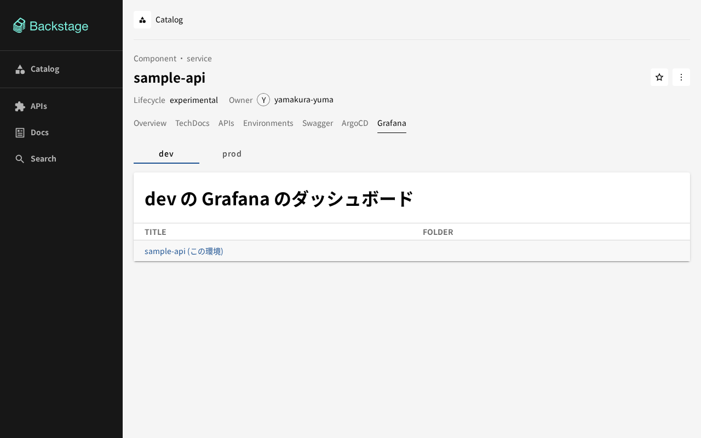
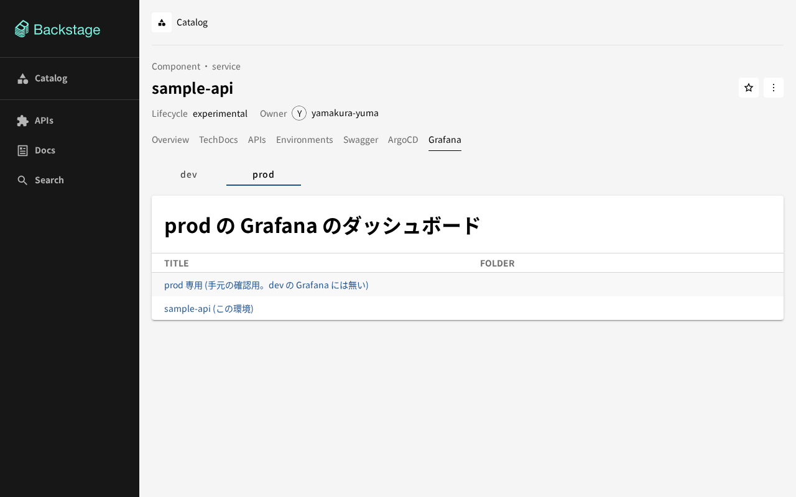
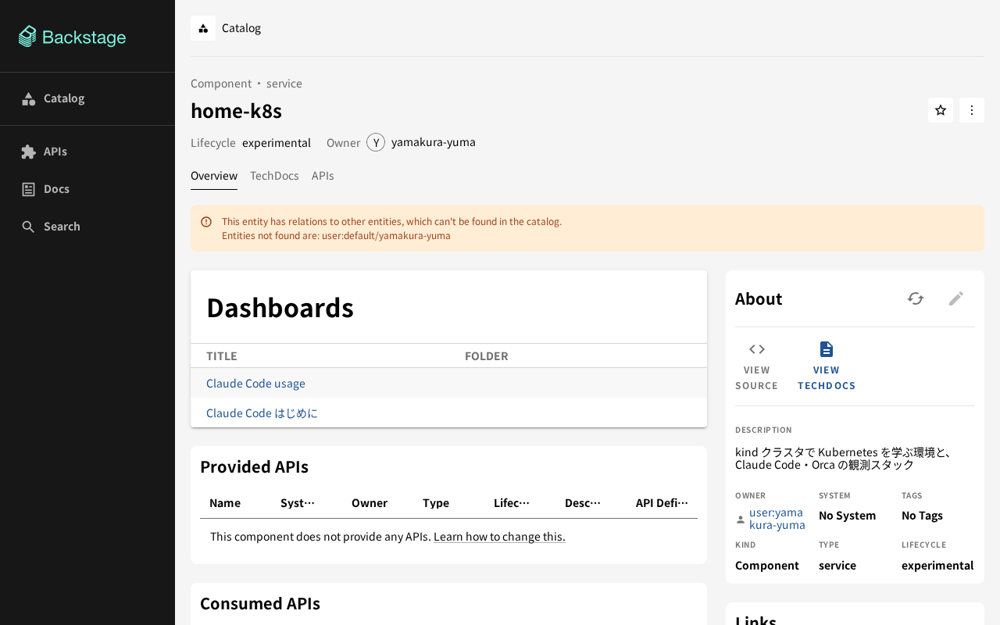

# Backstage に Grafana のタブを出す。環境 (dev・prod) ごとの観測スタック

エンティティ `sample-api` のページに **Grafana** のタブを置き、環境 (dev・prod) の切り替えで、それぞれの環境の
Grafana のダッシュボードの一覧を出す。環境ごとに Prometheus・Loki・Tempo・OTel Collector・Grafana の 5 つを、
ArgoCD の ApplicationSet で namespace `dev`・`prod` に立てる。namespace `observability` の観測スタック
(Claude Code・Orca の観測) は作り替えず、そのまま残す。
環境ごとのタブの仕組みと注釈の規約は [environments.md](environments.md)、Backstage 全体は [backstage.md](backstage.md)。

```text
ブラウザ ──▶ Backstage (localhost:7007)
              ├─ タブ Grafana  [dev] [prod]   ← 注釈 home-k8s/env.<環境>.grafana-host-id を選ぶ
              │     Grafana プラグインのカード (EntityGrafanaDashboardsCard)。iframe にしない
              └─ /api/proxy/grafana-dev/api/api/search?tag=sample-api
                    │  プロキシが Authorization: Basic ${GRAFANA_DEV_BASIC_AUTH} を付ける (ブラウザには渡らない)
                    ▼
                 grafana.dev.svc  ユーザー backstage (Viewer) ──▶ ダッシュボードの一覧
                 リンクの先はブラウザが開く画面 localhost:3001 (prod は 3002)

ApplicationSet env-grafana ─┬─ Application env-grafana-dev  ──▶ namespace dev
(env-prometheus・env-loki・ └─ Application env-grafana-prod ──▶ namespace prod
 env-tempo・env-otel-collector も同じ形)

namespace dev (prod も同じ)
  sample-api ──ログ──▶ OTel Collector (DaemonSet、filelog) ──▶ Loki ┐
  cAdvisor (kubelet) ◀──スクレイプ── Prometheus                      ├─▶ Grafana ──▶ Backstage のタブ
  アプリの OTLP ──▶ OTel Collector ──▶ Tempo・Prometheus・Loki       ┘
```

## 選んだもの

| 項目 | 選んだもの | 理由 |
|---|---|---|
| プラグイン | `@backstage-community/plugin-grafana` 1.1.0 (既に入れている) | `grafana.hosts` で host を複数持て、注釈 `grafana/host-id` で host を選べる。`/alpha` に新しいフロントエンドシステムの入口があり、既存の `home-k8s` のカードもこれで出ている。新しいプラグインを足さずに済む |
| 画面 | プラグインの `EntityGrafanaDashboardsCard` を、環境のタブの中で出す | プラグインの注釈 (`grafana/host-id`・`grafana/dashboard-selector`) は 1 つしか書けない。`entityForEnvironment` で環境の値 (`home-k8s/env.<環境>.grafana-host-id`・`grafana-dashboard-selector`) を重ねたエンティティを `EntityProvider` で渡し、プラグインに手を入れずに環境を切り替える。旧 API の部品なので `compatWrapper` で包む |
| iframe にしない | プロキシ経由のカード | Grafana は既定で埋め込みを拒み (`allow_embedding: false`)、許すと匿名か cookie のログインが要る。プロキシなら資格情報はバックエンドに置いたままで、既存のカードと同じ見た目で出せる |
| プロキシ | 環境ごとに `/grafana-dev/api`・`/grafana-prod/api` | プラグインは host ごとに別のプロキシの経路を要る (同じだと起動時に落ちる)。target は環境の namespace の Service `grafana.<環境>.svc.cluster.local` |
| 資格情報 | Grafana の Viewer の専用ユーザー `backstage` を環境ごとに作り、Basic 認証 | `just up` が Git の外のファイルから Secret を作る。既存の Grafana と同じやり方で、admin のパスワードは Backstage に渡さない |
| 環境の観測スタック | 5 つの ApplicationSet (list generator: dev・prod) | [environments.md](environments.md) の規約に乗る。`just ci` が環境ごとに展開して描画・検査する |
| 軽くする | 永続化なし (emptyDir)、保持 2 日、kube-state-metrics・node-exporter なし、Loki・Tempo は単一バイナリ、requests/limits あり | メモリの見積もりは下。kind の 1 ノードに 2 環境ぶんを足すので、既存の観測スタックより絞る |
| 集めるもの | 各環境の Prometheus は cAdvisor の、その環境の namespace の Pod の CPU・メモリ・ネットワークだけ。Loki は環境の OTel Collector が読んだ `sample-api` のログ。Tempo は環境の Collector に OTLP で届いたトレース | 環境ごとのスタックが、その環境の namespace のものだけを集める。`observability` のものは混ぜない |

## 設定する場所

| 何を | どこに | 中身 |
|---|---|---|
| 環境の観測スタック | `clusters/kind/argocd/apps/env-{prometheus,loki,tempo,otel-collector,grafana}.yaml` | ApplicationSet。chart と版は `observability` の Application と同じ (prometheus 29.35.0・loki 18.13.7・tempo 3.0.0・opentelemetry-collector 0.174.0・grafana 13.2.7) |
| values | `clusters/kind/env-<名前>/values.yaml` (共通) と `values-<環境>.yaml` (環境ごと) | 環境ごとの差は、Prometheus の ClusterRole の名前と namespace の絞り込み、Collector が読むログのパス、Grafana の NodePort |
| ダッシュボード | `clusters/kind/env-grafana/dashboards/` (`sample-api.json`、`kustomization.yaml`) | JSON の `tags` に `sample-api`。ConfigMap `grafana-dashboards-default` になり、Grafana の provisioning が読む。JSON を足したら `kustomization.yaml` の `files` も直す |
| タブ | `backstage/packages/app/src/modules/environments/GrafanaView.tsx`、`index.tsx` | `createEnvironmentContent({ requires: ['grafana-host-id', 'grafana-dashboard-selector'] })`。拡張 `entity-content:environments/grafana` |
| 注釈のキー | `annotations.ts` の `ENV_KEYS`、[environments.md](environments.md) の表 | `grafana-host-id`・`grafana-dashboard-selector` |
| エンティティの注釈 | `services/sample-api/catalog-info.yaml` | `home-k8s/env.dev.grafana-host-id: dev`、`home-k8s/env.dev.grafana-dashboard-selector: sample-api` (prod も同じ形)。エンティティ自身には `grafana/*` を書かない (観測スタックの Grafana の既定のカードがここにも出るため) |
| host | `backstage/app-config.yaml` の `grafana.hosts`・`grafana.defaultHost` | `default` (既存の `observability` の Grafana、`localhost:3000`、`/grafana/api`)・`dev` (`localhost:3001`、`/grafana-dev/api`)・`prod` (`localhost:3002`、`/grafana-prod/api`)。`defaultHost: default` |
| プロキシ | `backstage/app-config.yaml` の `proxy.endpoints./grafana-dev/api`・`/grafana-prod/api` | target `http://grafana.<環境>.svc.cluster.local`、`Authorization: Basic ${GRAFANA_<環境>_BASIC_AUTH}`、`allowedMethods: [GET]` |
| 資格情報を Backstage に渡す | `clusters/kind/backstage/values.yaml` の `extraEnvVarsSecrets` | Secret `backstage-grafana-env` (キー `GRAFANA_DEV_BASIC_AUTH`・`GRAFANA_PROD_BASIC_AUTH`) を環境変数にする |
| Secret を作る | `just/grafana-env-secrets.sh`、`just/observability.just` の `_grafana-env-secrets`、`justfile` の `up` | 下の「資格情報」 |
| 試験 | `GrafanaView.test.tsx`、`grafanaConfig.test.ts`、`just/test_share_secrets.py` の `GrafanaEnvSecrets` | 環境の切り替えと host の選択、`app-config.yaml` の host・プロキシ・注釈の突き合わせ、Secret を作るスクリプト |
| 画面のポート | `clusters/kind/kind-config.yaml` | dev 3001 (NodePort 30301)・prod 3002 (30302)。**この変更は Temporal の PR が足す**。足されるまで Service の NodePort は動くが、ホストの `localhost:3001` では開けない (タブの一覧は出る) |

`grafana.hosts` を書くと `grafana.domain` は無視される。既存の `grafana.domain`・`unifiedAlerting` は `hosts` の `default` に移した。
注釈 `grafana/host-id` を持たないエンティティ (`home-k8s`) は、`defaultHost` の `default` を向くので、既存のカードは変わらない。

## 資格情報

環境の Grafana には 2 つのユーザーがいる。

| ユーザー | ロール | パスワード | 使う者 |
|---|---|---|---|
| `admin` | Admin | `~/.local/share/home-k8s/observability/env-grafana/<環境>-admin-password` | 人 (画面に入る)。Secret `grafana-admin` (各環境の namespace) |
| `backstage` | Viewer | `.../<環境>-backstage-password` | Backstage のプロキシ。Secret `grafana-backstage` (各環境の namespace) が、Grafana の横のサイドカーがユーザーを作る元 |

`just up` は `just/grafana-env-secrets.sh` で、環境ごとに次をする。パスワードのファイルが無ければ作り (`openssl rand`、本人だけが読める)、2 回目以降は再利用する。

1. namespace `dev`・`prod` を (無ければ) 作る。ArgoCD の `CreateNamespace=true` と同じ名前
2. 各環境の namespace に Secret `grafana-admin` (`admin-user`・`admin-password`) と `grafana-backstage` (`password`) を入れる
3. namespace `backstage` に Secret `backstage-grafana-env` を、全環境のキーを 1 度に入れる。値は `backstage:<パスワード>` の base64 で、キーは `GRAFANA_DEV_BASIC_AUTH`・`GRAFANA_PROD_BASIC_AUTH`

Secret は `kubectl apply` ではなく `replace`・`create` で入れる (apply は値を `last-applied-configuration` の注釈に残す。#49)。
base64 にしても値なので、`--from-literal` ではなく `--from-file` と本人だけが読める一時ファイルで渡す (引数に出ると `ps` に残る。#56)。
Git に入るのは Secret の名前と環境変数の名前だけで、パスワードの値は入らない。ブラウザに渡る応答にも、Backstage の画面のバンドルにも入らない
(手元の docker で、プロキシ経由の応答のヘッダとバンドルを調べて確かめた)。

Grafana の横のサイドカー (`backstage-user`、`curlimages/curl`) が、Pod の起動ごとに一度だけ HTTP API でユーザー `backstage` を作る。
永続化しないので、Pod を作り直すたびに admin も `backstage` も、Secret の値で作り直される。Secret `grafana-backstage` が無いあいだは何もしない。

## 環境の観測スタックの中身

| ApplicationSet | chart | この環境でしていること |
|---|---|---|
| `env-prometheus` | `prometheus` 29.35.0 | cAdvisor だけをスクレイプし、`metric_relabel_configs` で、その環境の namespace の `container_cpu_usage_seconds_total`・`container_memory_working_set_bytes`・`container_network_{receive,transmit}_bytes_total` だけを残す。OTLP の受信も開ける。ClusterRole の名前は `prometheus-server-<環境>` (`prometheus-server` は `observability` が使っていて、クラスタに 1 つしか置けない) |
| `env-loki` | `loki` 18.13.7 | 単一バイナリ。OTLP (`/otlp`) を受ける。保持 2 日。ClusterRole を作らず namespace の Role にする (`rbac.namespaced`) |
| `env-tempo` | `tempo` 3.0.0 | 単一バイナリ。OTLP を受ける。保持 2 日 |
| `env-otel-collector` | `opentelemetry-collector` 0.174.0 | DaemonSet (worker の数だけ Pod)。その環境の `sample-api` の Pod のログ (`/var/log/pods/<環境>_sample-api-*/*/*.log`) を filelog で読み、アプリからの OTLP と合わせて同じ環境の Tempo・Prometheus・Loki へ渡す。スタック自身のログは読まない (Loki のログが Loki に入って増え続けるのを避ける)。受け口は Service `otel-collector-opentelemetry-collector` (ClusterIP、4317・4318。daemonset モードの chart は既定では Service を作らないので `service.enabled: true` を置く) |
| `env-grafana` | `grafana` 13.2.7 | データソースは同じ namespace の Prometheus・Loki・Tempo (Service 名は namespace の中の名前で引ける)。ダッシュボードは ConfigMap から provisioning。NodePort 30301 (dev)・30302 (prod)。匿名アクセスなし。ClusterRole を作らず namespace の Role にする |

`sample-api` のダッシュボード (`sample-api.json`) は、Pod の CPU・メモリ・受信・送信 (Prometheus) と、ログ (Loki) を出す。
`sample-api` は標準ライブラリだけの HTTP サーバーでトレースもアプリのメトリクスも出さないので、Tempo と Prometheus の OTLP の入口は
繋がっているだけで、いまは空。トレースを出すサービスを足したら、環境の Collector (`otel-collector-opentelemetry-collector.<環境>:4317・4318`) に送る。

## メモリの見積もり (環境ごと)

環境の土台 (PR #80) の見積もりが重いと見たもの (kube-state-metrics・node-exporter) を外し、永続化・保持・requests/limits を絞った。
値は実測ではなく、`observability` の同じ部品の実測 (2026-10-09、Grafana 239Mi・Tempo 224Mi・Prometheus 166Mi・Loki 71Mi・Collector 44Mi) から、
プラグインなし・系列が少ない・保持が短い、として見積もったもの。マージ後に `kubectl top` で実測して直す。

| 部品 | requests | limits | 見積もりの使用量 |
|---|---|---|---|
| Prometheus | 96Mi | 192Mi | 〜100Mi (cAdvisor の絞り込み後の系列は数百) |
| Loki | 64Mi | 192Mi | 〜70Mi |
| Tempo | 64Mi | 192Mi | 〜100Mi (空に近い) |
| OTel Collector (DaemonSet。worker 2 台なので 2 Pod。control-plane には taint があり tolerations を置かない) | 64Mi | 192Mi | 〜80Mi |
| Grafana (+ サイドカー) | 96Mi (+8Mi) | 256Mi (+32Mi) | 〜150Mi |
| **1 環境** | **392Mi** | **1.0GiB** | **〜500Mi** |
| **2 環境 (dev・prod)** | **784Mi** | **2.1GiB** | **〜1.0GiB** |

環境の土台の見積もり (観測スタック ×2 で +2.6〜3.6GiB、kind 全体で 5〜6GiB) より小さくなる。要るのは `requests` の 784Mi と、
実使用の〜1.0GiB。Pod は 1 環境で 6 つ (Prometheus・Loki・Tempo・Collector ×2・Grafana)、2 環境で 12 になり、inotify の instance
(`fs.inotify.max_user_instances`、このホストは 128) も使う。Pod が `too many open files` で起動しないときは、ホストで `sudo sysctl -w fs.inotify.max_user_instances=512` を打つ (要 root)。

## 確かめ方 (マージ後)

マージの前は、手元の docker で Backstage のイメージと Grafana を 3 つ (default・dev・prod) 動かし、プロキシの向き先だけを手元の Grafana にして画面を確かめた。
クラスタでの確認は、マージ後に人が `just up` を打ってから行う。

```sh
just up   # 環境の Secret を作り (grafana-env-secrets.sh)、Backstage のイメージを作り直し (0.7.0)、ArgoCD が環境の観測スタックを同期する
```

読み取りだけで確かめるコマンド:

```sh
ctx=kind-study-kind
# ApplicationSet が 5 つ、Application が環境ごとに 5 つ (計 10)。observability の Application は変わらない
kubectl --context $ctx -n argocd get applicationsets | grep '^env-'
kubectl --context $ctx -n argocd get applications | grep -E '^env-|^(prometheus|loki|tempo|otel-collector|grafana) '
# 環境の Pod が揃っている (prod も同じ。Collector は worker 2 台で 2 Pod)
kubectl --context $ctx -n dev get pods,svc
kubectl --context $ctx -n dev top pods     # メモリの実測。上の見積もりと比べる (metrics-server が無ければ crictl stats)
# Secret がある (値は表示しない)
for e in dev prod; do kubectl --context $ctx -n $e get secret grafana-admin grafana-backstage; done
kubectl --context $ctx -n backstage get secret backstage-grafana-env -o jsonpath='{.data}' | python3 -c 'import sys,json; print(sorted(json.load(sys.stdin)))'
# Backstage の Pod が環境変数を持っている (値は表示しない)
kubectl --context $ctx -n backstage exec deploy/backstage -- sh -c 'test -n "$GRAFANA_DEV_BASIC_AUTH" && test -n "$GRAFANA_PROD_BASIC_AUTH" && echo set'
# プロキシ経由で、環境の Grafana のダッシュボードが読める (ブラウザと同じ経路)
tok=$(curl -s -X POST http://localhost:7007/api/auth/guest/refresh | jq -r .backstageIdentity.token)
for e in dev prod; do
  curl -s -H "Authorization: Bearer $tok" "http://localhost:7007/api/proxy/grafana-$e/api/api/search?type=dash-db&tag=sample-api" | jq -r '.[].title'   # sample-api (この環境)
done
# 既存の Grafana (default) も変わらず読める
curl -s -H "Authorization: Bearer $tok" "http://localhost:7007/api/proxy/grafana/api/api/search?type=dash-db&tag=claude-code" | jq -r '.[].title' | head -3
# 環境の Prometheus が、その環境の Pod だけを集めている (namespace のラベルが dev だけ)
kubectl --context $ctx -n dev exec deploy/prometheus-server -c prometheus-server -- wget -qO- 'http://localhost:9090/api/v1/label/namespace/values'   # {"data":["dev"]}
# 環境の Loki に sample-api のログが入っている
kubectl --context $ctx -n dev exec loki-0 -- wget -qO- 'http://localhost:3100/loki/api/v1/label/k8s_pod_name/values' | head -c 200
```

画面は <http://localhost:7007/catalog/default/component/sample-api/grafana> を開き、`dev`・`prod` を切り替えて、それぞれの Grafana の
ダッシュボード (`sample-api (この環境)`) の一覧が出ること、リンクが各環境の Grafana (`localhost:3001`・`localhost:3002`、ポートが開いてから) に飛ぶことを確かめる。
`home-k8s` のページ (<http://localhost:7007/catalog/default/component/home-k8s>) の Dashboards のカードが、いままでと同じ一覧
(`observability` の Grafana の Claude Code・Kubernetes などのダッシュボード) のままであることも確かめる。





上の画面は、マージ前に build したイメージを手元の docker で動かし、Grafana を 3 つ (default `:23000`・dev `:23001`・prod `:23002`) 立てて撮ったもの。
dev と prod の違いが見えるよう、prod の Grafana にだけ「prod 専用」のダッシュボードを足した (実際の環境は同じ ConfigMap で、同じ一覧になる)。
プロキシの Basic 認証は、環境変数 `GRAFANA_DEV_BASIC_AUTH`・`GRAFANA_PROD_BASIC_AUTH` から入り、Grafana は Viewer の `backstage` として通した。
クラスタでの確認はマージ後に行う。

## 困ったとき

| 症状 | 見るところ |
|---|---|
| タブが出ない | エンティティに `home-k8s/environments` と `home-k8s/env.<環境>.grafana-host-id`・`grafana-dashboard-selector` があるか。カタログは GitHub の `main` から読むので、ブランチでは出ない |
| 「Request failed with 401」 | プロキシの Basic 認証が通っていない。環境の Grafana の Pod のサイドカー `backstage-user` のログに「backstage を作った」が出ているか。パスワードのファイルを消すなら、Secret ごと作り直すので `just up` を打ち直し、Grafana の Pod を作り直す |
| 「Request failed with 502」 | 環境の Grafana の Pod が起動していない。`kubectl -n dev get pods`、Application `env-grafana-dev` の同期 |
| 一覧が空 | ダッシュボードの JSON の `tags` に `sample-api` があるか。永続化していないので、UI で作ったものは Pod を作り直すと消える |
| Backstage の Pod が `CreateContainerConfigError` | Secret `backstage-grafana-env` が無い。`just up` の `_grafana-env-secrets` が失敗していないか |
| Backstage が起動時に落ちる (Grafana の host) | `grafana.hosts` の `proxyPath` が host で重なっている、`defaultHost` の id が `hosts` に無い、`id` が重なっている |
| ダッシュボードのリンクが開かない | `localhost:3001`・`3002` は kind-config の `extraPortMappings` が要る (Temporal の PR が足す。足したら `just down && just up` で作り直す) |
| Prometheus の ClusterRole が重なる | `clusterRoleNameOverride` が環境ごとの名前 (`prometheus-server-<環境>`) になっているか |
