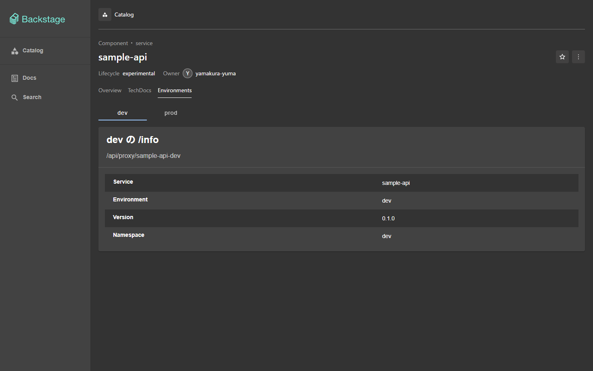
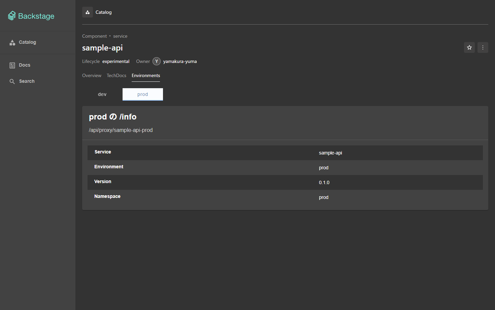

# 環境 (dev・prod) と、Backstage の環境ごとのタブ

1 つの kind クラスタの中に、namespace で環境を 2 つ (`dev`・`prod`) 置く。同じ構成を ArgoCD の
ApplicationSet で環境ごとに展開し、Backstage のエンティティのページでは、環境を切り替えて
それぞれの中身を出すタブを置く。この文書は、環境ごとに何かを足す PR (Swagger・Temporal・Grafana・
ArgoCD・Azure) が従う規約を決める。

```text
ApplicationSet <名前> (clusters/kind/argocd/apps/<名前>.yaml、list generator: dev・prod)
  ├─ Application <名前>-dev  ──▶ namespace dev
  └─ Application <名前>-prod ──▶ namespace prod

Backstage
  catalog-info.yaml の注釈 home-k8s/environments: dev,prod
                          home-k8s/env.<環境>.<キー>: <値>
  └─ エンティティのタブ (createEnvironmentContent)
       [dev] [prod]  ←切り替え (URL の ?env=)
       └─ 選んだ環境の値で中身を出す (例: /api/proxy/sample-api-dev/info)
```

既存の観測スタック (namespace `observability`、Claude Code の観測) は環境に入れず、そのまま残す。
環境ごとの観測スタックは、別に `dev`・`prod` に置く。

## 環境の置き方 (ApplicationSet)

- 環境は namespace の名前そのもの (`dev`・`prod`)。環境ごとに置くものは、すべてその namespace に入れる
- 環境ごとに置くものは、`clusters/kind/argocd/apps/` に ApplicationSet を 1 つ置く。root (app-of-apps) が
  ほかの Application と同じく GitHub の `main` から同期する
- generator は list で、要素は `env` だけを持つ (`- env: dev`、`- env: prod`)。環境で値を変えたいときは要素に
  キーを足し、template で `{{.キー}}` として使う
- template は `goTemplate: true` と `missingkey=error` (要素に無いキーを使うと同期の前に落ちる)
- template の中は `{{.キー}}` と空白なしで書く (`just ci` は文字列で置き換えるので、`{{ .env }}` は置き換わらずに落ちる)
- 生成する Application の名前は `<名前>-<環境>`、`destination.namespace` は `{{.env}}`、
  `syncOptions` に `CreateNamespace=true`
- chart を使うときは、values を `clusters/kind/<名前>/values.yaml` (共通) と
  `clusters/kind/<名前>/values-{{.env}}.yaml` (環境ごと) の 2 つにする

例は `clusters/kind/argocd/apps/sample-api.yaml` (repo の manifest を環境ごとに同期する)。

`just ci` (`just/ci.sh`) は、ApplicationSet を list の要素ごとに Application へ展開してから、ほかの
Application と同じく描画 (helm template・kustomize)・kubeconform・kube-linter に掛ける。list 以外の
generator や、要素で置き換わらない `{{ }}` が残る template は、`just ci` が落とす。

## エンティティの注釈の規約

環境ごとの接続先は、エンティティの `catalog-info.yaml` の注釈で持つ。

| 注釈 | 値 | 例 |
|---|---|---|
| `home-k8s/environments` | 環境の並び (カンマ区切り)。タブの切り替えに出す順 | `dev,prod` |
| `home-k8s/env.<環境>.<キー>` | その環境の値。キーは下の表 | `home-k8s/env.dev.api-proxy: /sample-api-dev` |

キーの一覧は `backstage/packages/app/src/modules/environments/annotations.ts` の `ENV_KEYS` が正本で、
この表と揃える。キーを足す PR は、両方を直す。

| キー | 値 | 使うタブ | 状態 |
|---|---|---|---|
| `api-proxy` | Backstage のバックエンドのプロキシの経路 (`/api/proxy` の下)。サービスの API を読む | Environments | この PR |
| `grafana-host-id` | `app-config.yaml` の `grafana.hosts[].id` (下の「Grafana」) | Grafana | 予定 |
| `temporal-url` | ブラウザが開く Temporal UI の URL | Temporal | 予定 |
| `argocd-app-name` | ArgoCD の Application の名前 (`<名前>-<環境>`) | ArgoCD | 予定 |

「予定」のキーは名前だけを決めておく。値の形は、そのタブを作る PR が決めてこの表を直す。

- プロキシの経路の名前は `/<サービス>-<環境>` (Grafana は `/grafana-<環境>/api`)。`app-config.yaml` の
  `proxy.endpoints` に環境ごとに 1 つ置き、`target` は `http://<Service>.<環境>.svc.cluster.local`
- 資格情報は注釈にもブラウザにも置かない。プロキシの `headers` に、`just up` が Git の外のファイルから
  作る Secret の値 (環境変数) を入れる ([backstage.md](backstage.md) の「Grafana の読み方」と同じ形)
- 環境に依らない値 (GitHub の slug など) は、ふつうの注釈のまま書く

## 環境を切り替えるタブ (新しいフロントエンドシステムの拡張)

タブは `backstage/packages/app/src/modules/environments/` のフロントエンドプラグイン `environments` が持つ。
`createEnvironmentContent` が `EntityContentBlueprint` (`@backstage/plugin-catalog-react/alpha`) で
エンティティのタブ (拡張 `entity-content:environments/<name>`) を作る。

```tsx
const temporalContent = createEnvironmentContent({
  name: 'temporal',            // 拡張の名前 entity-content:environments/temporal
  path: '/temporal',           // エンティティのページの下の経路
  title: 'Temporal',
  requires: ['temporal-url'],  // 使う環境のキー。どの環境にも揃っていないエンティティにはタブを出さない
  render: env => <TemporalView url={env.values['temporal-url']} />,
});
// index.tsx の environmentsPlugin の extensions に足す
```

- 環境の切り替えはタブの上の `dev`・`prod`。選んだ環境は URL の `?env=` に持ち、リンクで環境を指せる。
  無い・知らない環境なら、並びの先頭 (`dev`)
- 中身は環境ごとに作り直す (前の環境の読み込み結果を残さない)
- 1 つのインスタンス前提のプラグインは、`entityForEnvironment(entity, env, { <プラグインの注釈>: <キー> })`
  で、環境の値をプラグインの注釈に重ねたエンティティを作り、`EntityProvider` で渡してプラグインの部品を
  そのまま使う。プラグインに手を入れずに環境を切り替えられる
- プラグインに `/alpha` (新しいフロントエンドシステム) の入口が無いときは、部品 (React の component) を
  そのまま `render` で使うか、`@backstage/core-compat-api` の `compatWrapper` で包む

いまあるタブは、サンプルの API の `/info` を環境ごとに出す **Environments** (`entity-content:environments/service`、
キー `api-proxy`) だけ。

## サンプルの API (sample-api)

`services/sample-api/` に、環境ごとのタブの確かめ役のサービスを置く。

| ファイル | 中身 |
|---|---|
| `app.py` | 標準ライブラリの HTTP サーバー。`/info` (サービス名・環境・版)、`/hello`、`/healthz`、`/openapi.yaml` |
| `openapi.yaml` | OpenAPI 3。`app.py` が配り、API エンティティが `$text` で読む (正本は 1 つ) |
| `test_app.py` | 経路の試験と、`openapi.yaml` の `paths` がどれも配られていることの確かめ (`just ci`) |
| `kustomization.yaml`・`deployment.yaml` | `app.py` と `openapi.yaml` を ConfigMap にし、`python:3.13-alpine` で動かす。Service は ClusterIP だけ |
| `catalog-info.yaml` | Component `sample-api` (`providesApis: [sample-api]`、環境の注釈) と API `sample-api` |

- イメージは作らない (`just up` に build を足さない)。コードを変えると ConfigMap の名前のハッシュが変わり、Pod が作り直される
- 環境の名前は Pod の namespace (Downward API の `APP_ENV`) から取る。dev と prod は同じ manifest
- カタログには、repo の直下の `catalog-info.yaml` の Location `home-k8s-services` が読ませる。
  サービスを足したら、その `targets` にサービスの `catalog-info.yaml` を足す
- ブラウザからは Backstage のプロキシ `/api/proxy/sample-api-dev`・`/api/proxy/sample-api-prod` (GET だけ) で読む。
  共有 (`just share`) の caddy は `/api/proxy/*` を通さないので、共有先では読めない

## Grafana (環境ごとの観測スタック)

既存の Grafana プラグイン (`@backstage-community/plugin-grafana` 1.1.0) は、`grafana.domain` と 1 つのプロキシ
だけでなく、`grafana.hosts` で複数の Grafana を持てる (各 host は `id`・`domain`・`proxyPath`)。エンティティの
注釈 `grafana/host-id` がどの host を読むかを決め、無ければ `grafana.defaultHost`。

**決めたこと: 環境ごとのプロキシ＋切り替え** (iframe は使わない)。

```yaml
# app-config.yaml (Grafana の PR で入れる形)
grafana:
  defaultHost: default                     # 注釈 grafana/host-id の無いエンティティ (home-k8s) はいままでどおり
  hosts:
    - id: default                          # 既存の observability の Grafana
      domain: http://localhost:3000
      proxyPath: /grafana/api
    - id: dev
      domain: <dev の Grafana をブラウザが開く URL>
      proxyPath: /grafana-dev/api
    - id: prod
      domain: <prod の Grafana をブラウザが開く URL>
      proxyPath: /grafana-prod/api
proxy:
  endpoints:
    '/grafana-dev/api':
      target: http://grafana.dev.svc.cluster.local
      headers:
        Authorization: Basic ${GRAFANA_DEV_BASIC_AUTH}
    # prod も同じ形
```

- `grafana.hosts` を書くと `grafana.domain` は無視されるので、既存の `grafana.domain`・`unifiedAlerting` は
  `hosts` の `default` に移す。プロキシの経路は host ごとに別でないとプラグインが起動時に落とす
- タブは `createEnvironmentContent({ requires: ['grafana-host-id'], ... })` で作り、
  `entityForEnvironment(entity, env, { 'grafana/host-id': 'grafana-host-id' })` を `EntityProvider` で渡して、
  プラグインの `EntityGrafanaDashboardsCard` をそのまま出す。ダッシュボードの選び方 (`grafana/dashboard-selector`) は環境で共通
- 資格情報は環境ごとに、既存と同じ Viewer の専用ユーザー `backstage` を Basic 認証で読む
  (`just up` が Git の外のファイルから Secret を作る)

iframe にしない理由: Grafana は既定で埋め込みを拒み (`allow_embedding: false`)、許すと匿名か cookie の
ログインが要る。プロキシなら資格情報はバックエンドに置いたまま、既存の Grafana のカードと同じ見た目で出せる。

## 環境ごとの画面の URL (ポート)

Temporal UI や環境ごとの Grafana をブラウザで開くには、ホストのポートが要る。kind の `extraPortMappings` は
クラスタを作るときにしか効かない (足したら `just down && just up` で作り直す。PV のデータはホストのディレクトリに残る)。
足す PR が同じ作り直しを何度も求めないよう、ポートは次の並びで取る。**予約だけで、この PR では kind-config を変えていない**
(ポートを使う PR が `clusters/kind/kind-config.yaml` に足す)。

| 画面 | dev | prod | NodePort (dev / prod) |
|---|---|---|---|
| Grafana | 3001 | 3002 | 30301 / 30302 |
| Temporal UI | 8233 | 8234 | 30233 / 30234 |

## 確かめ方

```sh
kubectl --context kind-study-kind -n argocd get applicationsets,applications | grep sample-api
kubectl --context kind-study-kind -n dev get pods,svc     # prod も同じ
tok=$(curl -s -X POST http://localhost:7007/api/auth/guest/refresh | jq -r .backstageIdentity.token)
curl -s -H "Authorization: Bearer $tok" http://localhost:7007/api/proxy/sample-api-dev/info    # "environment": "dev"
curl -s -H "Authorization: Bearer $tok" 'http://localhost:7007/api/catalog/entities/by-name/api/default/sample-api' | jq -r .spec.definition | head -3
```

ブラウザでは <http://localhost:7007/catalog/default/component/sample-api/environments> を開き、
`dev`・`prod` を切り替えて `/info` の `environment` が変わることを確かめる。




上の画面は、マージ前に build したイメージ (0.4.0) を手元の docker で動かし、sample-api を dev・prod の 2 つの
プロセスで立てて撮ったもの。kind での確認はマージ後に行う。
