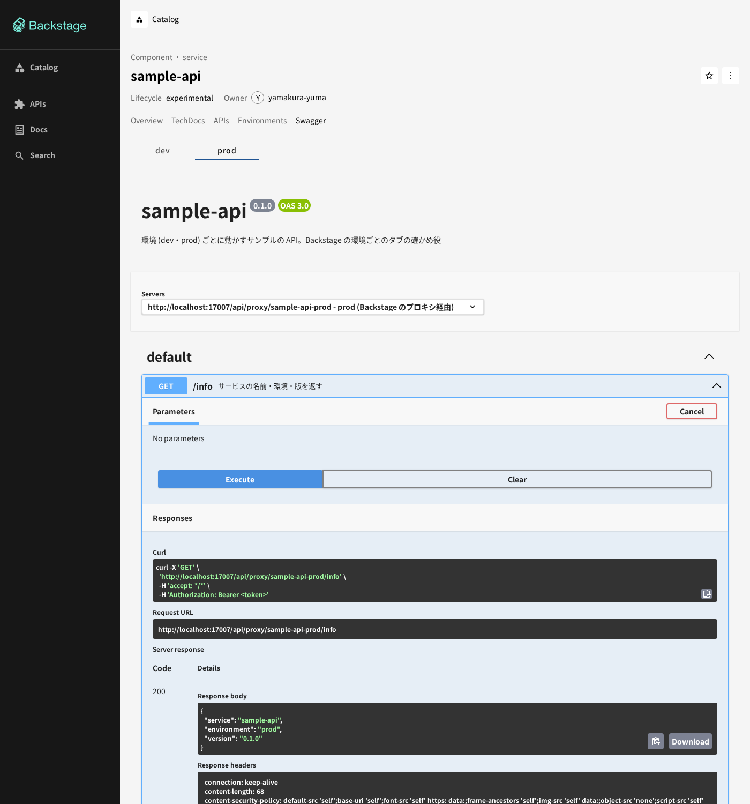
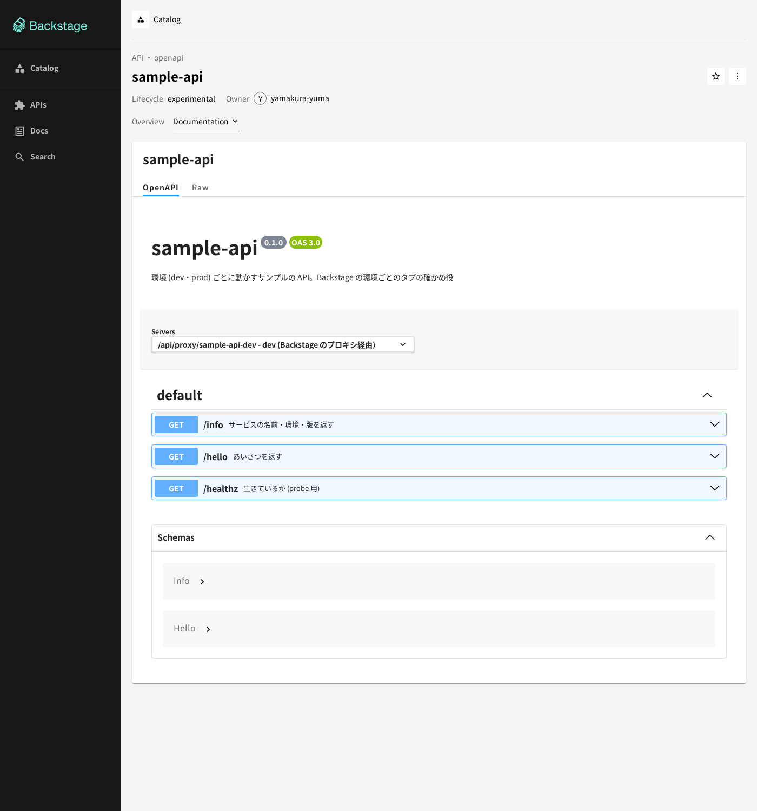

# Swagger のタブ (sample-api)

Backstage のエンティティ `sample-api` (Component) のページに、**Swagger** のタブを置く。OpenAPI の定義を
Swagger UI で出し、タブの上の `dev`・`prod` で、Try it out の向き先 (servers) を環境ごとのプロキシに切り替える。
API エンティティへ移らずに、Component のページの中で読んで試せる。環境の規約は [environments.md](environments.md)。

```text
Component sample-api ──providesApis──▶ API sample-api (spec.type: openapi、定義は services/sample-api/openapi.yaml)
  └─ タブ Swagger  [dev] [prod]
       └─ OpenApiDefinitionWidget (@backstage/plugin-api-docs)
            servers = [ http://localhost:7007/api/proxy/sample-api-<環境> ]   ← 選んだ環境だけに差し替える
            Try it out ──GET + Bearer──▶ Backstage のバックエンドのプロキシ ──▶ sample-api.<環境>.svc
```

## 使うもの

| 部品 | 置き場所 | 中身 |
|---|---|---|
| プラグイン | `@backstage/plugin-api-docs` 0.14.5 (`/alpha`) | 新しいフロントエンドシステムの入口。`backstage/packages/app/src/App.tsx` の `features` に足す。API エンティティの **Definition** (拡張 `entity-content:api-docs/definition`)、Component の **APIs** (`entity-content:api-docs/apis`)、`/api-docs` の一覧が付く |
| タブ | `backstage/packages/app/src/modules/environments/SwaggerView.tsx` | 拡張 `entity-content:environments/swagger` (`/swagger`、キー `api-proxy`)。`index.tsx` の `createEnvironmentContent` に乗せる |
| servers の差し替え | `modules/environments/openapi.ts` | `js-yaml` で定義を読み、`servers` を選んだ環境のプロキシ 1 つにして swagger-ui へ渡す |
| 定義 | `services/sample-api/openapi.yaml` | サービスのコードの隣。`catalog-info.yaml` の API エンティティが `$text: ./openapi.yaml` で読む。正本は 1 つ |

`@backstage/plugin-api-docs` の `ApiDefinitionCard` は、いま開いているエンティティ (ここでは Component) の
`spec.definition` を読むので、Component のタブには使えない。そこで Component の `providesApis` の API を
`useRelatedEntities` で引き、その定義を、同じパッケージの `OpenApiDefinitionWidget` (swagger-ui-react の
ラッパー) に渡している。見た目と部品は API エンティティの Definition と同じ。

## 環境ごとの向き先

- タブの `dev`・`prod` は、`catalog-info.yaml` の注釈 `home-k8s/env.<環境>.api-proxy` (`/sample-api-dev`・
  `/sample-api-prod`) から作る。注釈が無い環境は並ばず、どの環境にも無いエンティティにはタブを出さない
- `servers` は、`/api/proxy` の基準 URL (`discoveryApi.getBaseUrl('proxy')`) に注釈の値を続けたもの 1 つ。
  `openapi.yaml` に書いた `servers` (相対のプロキシ経路 2 つ) は、API エンティティの Definition にだけ効く
- Try it out は、バックエンドの認証 (ゲスト) のトークンを要る。swagger-ui の fetch は Backstage の `fetchApi`
  を通らないので、`requestInterceptor` で向き先への要求にだけ `Authorization: Bearer` を付ける
  (`identityApi.getCredentials()`)。ほかの URL にはトークンを渡さない
- プロキシは GET だけ通す (`app-config.yaml` の `proxy.endpoints./sample-api-*.allowedMethods`)。
  そのため Try it out を実行できるメソッドも GET だけにしてある。POST などを足すときは、
  `allowedMethods` と `SwaggerView.tsx` の `SUBMIT_METHODS` を一緒に直す
- 共有 (`just share`) の caddy は `/api/proxy/*` を通さないので、共有先では Try it out は動かない (定義は読める)

## 使い方

1. <http://localhost:7007/catalog/default/component/sample-api/swagger> を開く (`?env=prod` で prod)
2. タブの `dev`・`prod` を選ぶ。Servers が `…/api/proxy/sample-api-dev` か `…-prod` になる
3. `GET /info` を開き、Try it out → Execute。Response body の `environment` が選んだ環境になる




API エンティティ (<http://localhost:7007/catalog/default/api/sample-api/definition>) の Definition でも、同じ定義が読める。
こちらは `openapi.yaml` の `servers` のまま (相対の経路 2 つから選ぶ) で、Backstage の画面の origin を向く。
こちらの Try it out にはトークンが付かないので、バックエンドに 401 で断られる。試すのは Component の Swagger のタブで行う。



上の画面は、マージ前に build したイメージ (0.5.0) を手元の docker で動かし、sample-api を dev・prod の 2 つの
プロセスで立てて撮ったもの。kind での確認はマージ後に行う (下)。

## マージ後に、クラスタで確かめる手順

`just up` のあと (Backstage のイメージ 0.5.0 が入り、Application `backstage` が作り直される)。読み取りだけ:

```sh
# sample-api が dev・prod にいる (土台の PR の確かめ方と同じ)
kubectl --context kind-study-kind -n argocd get applications | grep sample-api
kubectl --context kind-study-kind -n dev get pods,svc
kubectl --context kind-study-kind -n backstage get deploy backstage -o jsonpath='{..image}'   # home-k8s-backstage:0.5.0

# プロキシ越しに、Swagger の Try it out と同じ要求を送る
tok=$(curl -s -X POST http://localhost:7007/api/auth/guest/refresh | jq -r .backstageIdentity.token)
curl -s -H "Authorization: Bearer $tok" http://localhost:7007/api/proxy/sample-api-dev/info    # "environment": "dev"
curl -s -H "Authorization: Bearer $tok" http://localhost:7007/api/proxy/sample-api-prod/info   # "environment": "prod"
# API エンティティと Component の関係 (providesApis)
curl -s -H "Authorization: Bearer $tok" http://localhost:7007/api/catalog/entities/by-name/component/default/sample-api | jq '.relations[] | select(.type=="providesApi")'
```

画面で見るもの:

- <http://localhost:7007/catalog/default/component/sample-api> のタブに **Swagger** がある
- Swagger を開き、`dev` では Servers が `http://localhost:7007/api/proxy/sample-api-dev`、`prod` では `…-prod`
- どちらも `GET /info` の Try it out → Execute が 200 を返し、Response body の `environment` が選んだ環境と同じ
- 別のエンティティへ移っていない (URL は `/catalog/default/component/sample-api/swagger` のまま)
- <http://localhost:7007/catalog/default/api/sample-api/definition> で、API エンティティの Definition が出る
