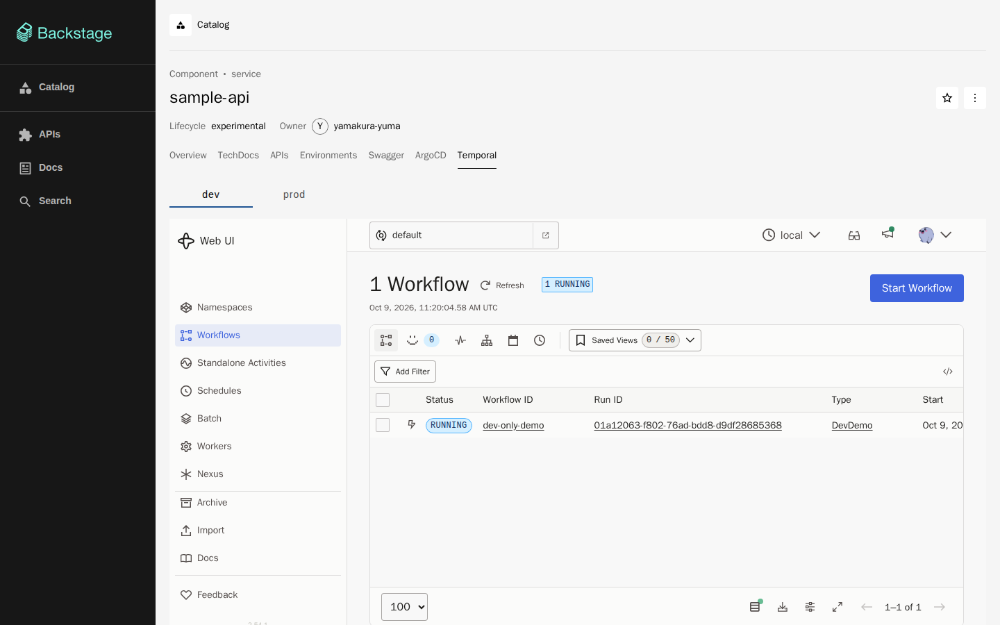
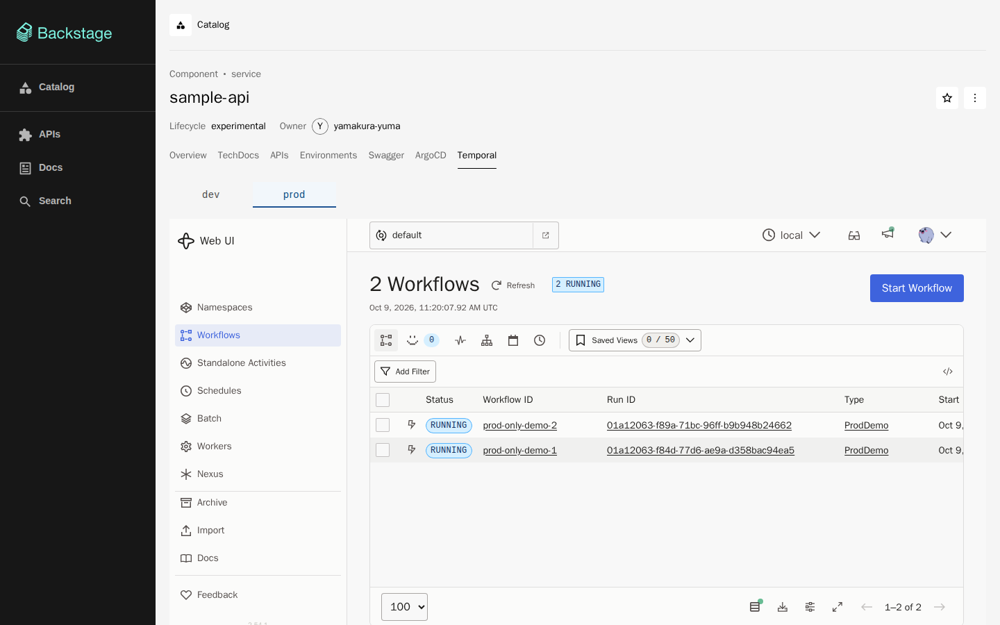

# Temporal (dev・prod) と、Backstage の Temporal のタブ

環境 (namespace `dev`・`prod`) ごとに Temporal のサーバーと Web UI を立て、Backstage のエンティティ `sample-api` のページに
**Temporal** のタブを置く。タブの上の `dev`・`prod` を選ぶと、その環境の Temporal Web UI が iframe で出る。
環境の規約は [environments.md](environments.md)。

```text
ApplicationSet temporal         ─▶ Application temporal-dev / temporal-prod
  公式 chart temporal 1.7.0 (frontend・history・matching・worker・web、各レプリカ 1)
ApplicationSet temporal-support ─▶ Application temporal-support-dev / temporal-support-prod
  clusters/kind/temporal/overlays/<環境> = PostgreSQL (StatefulSet) + proxy temporal-ui-embed (Caddy)

ブラウザ ── localhost:7007 Backstage ── タブ Temporal [dev] [prod]
                                          └─ iframe src = 注釈 home-k8s/env.<環境>.temporal-url
                                               dev  http://localhost:8233 ─▶ NodePort 30233 ─▶ temporal-ui-embed ─▶ temporal-web:8080 ─▶ temporal-frontend:7233
                                               prod http://localhost:8234 ─▶ NodePort 30234 ─▶ (同じ形)
```

## 立てるもの (環境ごとに 1 組)

| もの | 置き場所 | 中身 |
|---|---|---|
| Temporal 本体 | `clusters/kind/argocd/apps/temporal.yaml` (ApplicationSet)、`clusters/kind/temporal/values.yaml`・`values-<環境>.yaml` | 公式 chart (`temporalio/helm-charts`、<https://go.temporal.io/helm-charts>) の `temporal` 1.7.0 (サーバー 1.32.0、Web UI 2.54.1)。release 名 `temporal` なので Service は `temporal-frontend`・`temporal-web` |
| DB | `clusters/kind/temporal/base/postgres.yaml` | PostgreSQL 17.6 の StatefulSet 1 つ (PVC 1Gi、kind の既定の StorageClass)。DB 名は `temporal`・`temporal_visibility`。chart は DB を持たないので別に置く |
| UI の proxy | `clusters/kind/temporal/base/ui-embed.yaml`・`Caddyfile` | Caddy。Web UI の `X-Frame-Options` を外し、`frame-ancestors` で Backstage だけに埋め込みを許す (下) |
| 環境ごとの差 | `clusters/kind/temporal/overlays/<環境>`、`values-<環境>.yaml` | proxy の NodePort (dev 30233・prod 30234) と、namespace `default` の保存期間 (dev 1d・prod 7d) |
| タブ | `backstage/packages/app/src/modules/environments/TemporalView.tsx` | 拡張 `entity-content:environments/temporal` (`/temporal`、キー `temporal-url`)。`index.tsx` の `createEnvironmentContent` に乗せる |

DB を別の Application (`temporal-support`) に分けたのは、chart の schema ジョブ (データベースの作成とスキーマ) が
`helm.sh/hook: pre-install,pre-upgrade` で、ArgoCD ではそれが **PreSync** になるため。DB を chart と同じ Application に入れると、
ジョブが DB より先に走って待ち続け、DB はジョブが終わるまで作られない。分ければ、ジョブは DB が立つまで再試行する
(`schema.backoffLimit` 100)。同じ理由で `schema.useHelmHooks: false` にはしていない (フックなしだとジョブ名に release の
revision が入り、ArgoCD ではいつも 1 なので、chart の版を上げたときに immutable な Job を更新しようとして落ちる)。

## 設定の仕方 (セットアップの項目)

### Temporal の chart (`clusters/kind/temporal/values.yaml`)

- **メモリを詰める**: 各サーバー (frontend・history・matching・worker) と web はレプリカ 1、すべてに requests/limits を置く。
  `admintools.enabled: false` (temporal CLI の管理用 Pod は置かない。schema・namespace を作るジョブは同じイメージを別に使うので影響しない)。
  `server.config.persistence.numHistoryShards: 4` (既定は 512。history のメモリが減る。**DB を作った後では変えられない**)、
  `server.config.logLevel: info`
- **DB**: `server.config.persistence.datastores.default.sql`・`visibility.sql` に `pluginName: postgres12`、`connectAddr: temporal-postgres:5432`、
  `databaseName: temporal` と `temporal_visibility`、`user: temporal`。パスワードは `existingSecret: temporal-postgres`・`secretKey: password`
  (Secret は `postgres.yaml` が作る。DB の起動と chart が同じ 1 か所を読む)。chart が `createDatabase`・`manageSchema` を既定で true にするので、
  schema ジョブがデータベースとスキーマを作る
- **namespace**: `server.config.namespaces.create: true` で Temporal の namespace `default` を作る (Web UI が最初に開く)。
  保存期間は `values-<環境>.yaml` (dev 1d・prod 7d)
- **Web UI**: `web.service` は ClusterIP のまま。ホストへ出すのは proxy
- chart の版は ApplicationSet の `targetRevision`。上げたら `just ci` の `helm template` が新しい版で描画する

DB のパスワード `temporal` は Git に書いてある固定値。DB は ClusterIP の Service だけで、クラスタの外にも他の namespace 向けの口にも出していない
学習用の DB なので、他の Secret のように `just up` で Git の外から作ることはしていない。

### Temporal Web UI を iframe に出す (開けたヘッダーとその理由)

Temporal 用の Backstage のプラグインは npm に無い (調べた範囲では見つからなかった) ので、タブは Web UI を iframe で出す。
そのために、2 か所を必要なだけ開けた。

| どこで | 何を | 理由 |
|---|---|---|
| Web UI 側 (`clusters/kind/temporal/base/Caddyfile`) | レスポンスの `X-Frame-Options: SAMEORIGIN` を**外す** | Web UI (ui-server) はこのヘッダーを返し、設定で変えられない (環境変数・設定ファイルに項目が無い)。Backstage は `localhost:7007`、Web UI は `localhost:8233`・`8234` で、ポートが違えば別のオリジンなので、このままでは iframe が拒まれる |
| 同じ Caddyfile | `Content-Security-Policy: frame-ancestors 'self' http://localhost:7007` を**付ける** | `X-Frame-Options` を外しただけでは、どのページにも埋め込めてしまう。最近のブラウザは `frame-ancestors` を `X-Frame-Options` より優先するので、埋め込める親を Backstage のオリジンと Web UI 自身に絞る。`'self'` は、Web UI がお知らせ (What's new) を自分の `/render` の iframe に入れるためで、親が Backstage と Web UI の 2 段になる。`'self'` が無いと、その iframe がコンソールに `Framing ... violates ... frame-ancestors` を出して空になる |
| Backstage 側 (`backstage/app-config.yaml` の `backend.csp`) | `frame-src: ['self', 'http://localhost:8233', 'http://localhost:8234']` | Backstage の CSP は `default-src 'self'` で、`frame-src` を書かないと `'self'` 以外の iframe を拒む。環境ごとの Web UI の 2 つのオリジンだけを足した |

proxy が触るのは上の 2 つのヘッダーだけで、本文は書き換えない。Web UI の cookie (`_csrf`、`SameSite=Strict`) は、`localhost` の
ポート違いが同じ site なので、iframe の中でもそのまま送られる (Web UI の書き込み操作にも CSRF の検査が通る)。

proxy はホストの 127.0.0.1 にだけ出す (kind-config の `listenAddress`)。Web UI は認証が無いので、`0.0.0.0` には開けない。
共有 (`just share`) の caddy は Temporal UI を通さないので、共有先ではタブの中身は出ない。

### 注釈 (キー `temporal-url`)

`services/sample-api/catalog-info.yaml` に、環境ごとのブラウザが開く URL を書く (キーの一覧は [environments.md](environments.md))。

```yaml
home-k8s/env.dev.temporal-url: http://localhost:8233
home-k8s/env.prod.temporal-url: http://localhost:8234
```

`http`・`https` 以外の値 (`javascript:` など) は iframe に渡さず、案内を出す (`TemporalView.tsx` の `temporalEmbedUrl`)。
URL を変えたら、Backstage の CSP の `frame-src` と proxy の NodePort・kind-config も揃える。

### 画面のポート (kind-config)

`clusters/kind/kind-config.yaml` の control-plane の `extraPortMappings` に、環境ごとの画面の 4 つを足した
([environments.md](environments.md) の「環境ごとの画面の URL」の予約のとおり)。

| 画面 | ホスト | NodePort | 使う PR |
|---|---|---|---|
| dev の Temporal UI | 127.0.0.1:8233 | 30233 | この PR (proxy `temporal-ui-embed`) |
| prod の Temporal UI | 127.0.0.1:8234 | 30234 | この PR |
| dev の Grafana | 127.0.0.1:3001 | 30301 | Grafana の PR (この PR では開けるだけ) |
| prod の Grafana | 127.0.0.1:3002 | 30302 | Grafana の PR |

**`extraPortMappings` はクラスタを作るときにしか効かない。マージ後は、人が `just down && just up` でクラスタを作り直す。**
PV のデータ (観測スタックの保存先) はホストのディレクトリに残る。Backstage のイメージ (0.7.0) も `just up` が入れ直す。
作り直しの間は、観測スタックと Backstage が止まる。

## メモリの見込み

環境 1 つの requests/limits の合計。実測は、マージ後に `crictl stats` で取り直す。

| もの | requests | limits |
|---|---|---|
| frontend・history・matching・worker | 128・128・96・96 Mi | 384・512・384・384 Mi |
| web | 32Mi | 128Mi |
| PostgreSQL | 64Mi | 256Mi |
| proxy (Caddy) | 16Mi | 64Mi |
| 計 (schema ジョブは一時的) | 約 560Mi | 約 2.1GiB |

使用量は requests と limits の間 (見込みは環境 1 つで 0.5〜0.7GiB、2 つで 1.0〜1.4GiB)。[environments.md](environments.md) の
見積もりでは Temporal を 0.6〜0.9GiB と置いていたので、それより軽くした (admintools を置かない・シャード数を減らした分)。
足りないときの対策は、`prod` を使わない間は ApplicationSet の list の要素を外す (Application ごと消える)、WSL の `memory=` を上げる。

## マージ後に、クラスタで確かめる手順

ポートを足したので、**人が先にクラスタを作り直す** (話題チャットは読み取りだけ)。

```sh
just down && just up    # extraPortMappings を効かせる。初回は image の pull で数分かかる
```

読み取りのコマンド (kind-study-kind に何も書かない):

```sh
# 4 つの Application (temporal-support-{dev,prod}・temporal-{dev,prod}) が Synced / Healthy
kubectl --context kind-study-kind -n argocd get applicationsets,applications | grep temporal
# 各環境の Pod: temporal-{frontend,history,matching,worker,web}・temporal-postgres-0・temporal-ui-embed が Running
kubectl --context kind-study-kind -n dev get pods,svc,pvc | grep temporal
kubectl --context kind-study-kind -n prod get pods,svc,pvc | grep temporal
# schema ジョブと namespace ジョブが Completed (ttl 1 日で消える。消えていたら、下の Web UI の応答で足りる)
kubectl --context kind-study-kind -n dev get jobs
# ホストのポートの先で Web UI が応える。X-Frame-Options は無く、frame-ancestors がある
curl -s -D - -o /dev/null http://localhost:8233/ | grep -i -E 'HTTP|frame|content-security'
curl -s -D - -o /dev/null http://localhost:8234/ | grep -i -E 'HTTP|frame|content-security'
# Web UI から frontend への経路 (namespace default が作られている)
curl -s http://localhost:8233/api/v1/namespaces | head -c 300
# Backstage の CSP に frame-src がある
curl -s -D - -o /dev/null http://localhost:7007/ | grep -i content-security-policy | tr ';' '\n' | grep frame-src
# メモリの実測
docker exec study-kind-control-plane crictl stats
```

画面で見るもの:

- <http://localhost:7007/catalog/default/component/sample-api> のタブに **Temporal** がある
- Temporal を開くと `dev` の Temporal Web UI (Workflows の一覧、namespace `default`) が iframe の中に出る。`prod` に切り替えると
  URL が `?env=prod` になり、`prod` の Web UI に変わる (UI の URL は 8233 → 8234)
- ブラウザの開発者ツールのコンソールに、`Refused to frame` (CSP・X-Frame-Options) が出ていない

## 手元の docker での確認 (マージ前)

クラスタに触れずに、次の形で確かめた。

- `temporalio/temporal` の `server start-dev` (サーバー + Web UI が 1 プロセス) を dev・prod の 2 つ、別の docker network で立てる。
  どちらも network alias `temporal-web`、UI のポート 8080 にして、本番と同じ `Caddyfile` の Caddy (nonroot・読み取り専用の root。
  `frame-ancestors` の Backstage の分だけ手元に合わせて `localhost:17007` に置き換えた) をそれぞれの前に置き、127.0.0.1 の 8233・8234 に出す
- Backstage のイメージ (`home-k8s-backstage:0.7.0`) を `--network host` のポート 17007 で動かし、`sample-api` の
  `catalog-info.yaml` を http.server で配って読ませる。プロキシの向き先だけ手元の sample-api に上書きする設定を重ねる



